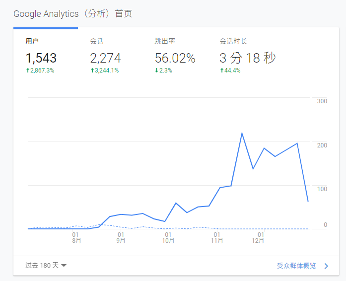
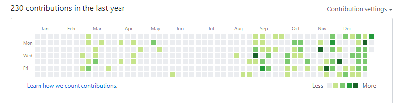
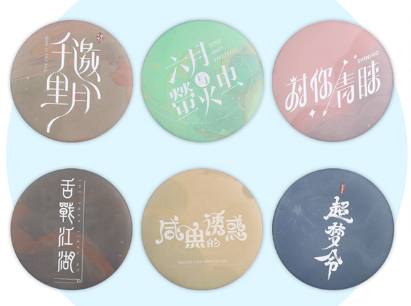

# 2019 年终总结

有确说实, 2019 年过得算是浑浑噩噩, 技术没进步多少, 摸鱼划水到时不少, 6 月份辞职休息, 8 月份开始重启博客计划,  到现在发了有 30 来篇, 最近刚过了 20 岁的生日, 感觉自己也不小了, 最近空闲的时间全是在打 LOL 和刷沙雕视频中度过, 逐渐的变成沙雕, 唯一庆幸的事情就是体重减的差不多了, 至少看不出胖了

    
贯穿全年的词就是

	
慵懒

<!--truncate-->

## 首先是本站相关数据汇总

2019 年站务数据 

* 从8月1日开始算起,  总计 1543 个用户 发起了 2274 次会话 (月均 20 % 提高)
* 被访问最多次数的文章是  [unraid初体验(370次) ](https://haozi.moe/2019/08/22/unraid初体验/) , 以及 [unraid](https://haozi.moe/tags/#unraid) 相关的文章
* 有 79% 的用户使用桌面设备, 21% 的用户使用移动设备
* 总计更新了 32 篇文章, 月均 8 篇, 多为展示向, 教程向

## 个人相关

### 二月

* 换了新的 MacBook 2018 15 寸 32G i7 6核
* 因为 VDS 入门了一点 CUDA 编程, 还是和 OpenGL 死在了数学上面
* 入手了 Switch + 塞尔达卡带 (截止2019年底没打完), 虽然买了一些数字版的游戏但是仍然吃灰,

### 三月

* 入手了 恶魔五月哭 (383 ¥), 没打完, 最后看着纯黑视频通关了

### 四月

* 和新的合租伙伴换了新的地方住, 离地铁口进了(但是我走路上班不坐地铁).  楼下电影院健身房蛮方便的, 但是租金 UP
* 更换了新的路由器 AC86U
* 从朋友手里低价手了双口的 X502 光纤卡, 从服务器到我大奶拉了一根 光纤线, 可以吃满 NAS 的性能(稳定读写 600M/s)
* 入手了 港版 Apple Watch (目前表盘有点伤痕, 建议贴个膜 )

### 六月

* 更新了 MacOS Sierra 10.15 Beta 噩梦开始, Docker 啥的一堆东西挂掉了
* 毕业了,  因为没还学校图书馆的书, 毕业证迟发, 还书一周后获得了毕业证
* 深户体检发现轻度脂肪肝, 指标没过, 去医院开了点药, 然后开始减肥计划
* 因为脂肪肝, 离职休养
* 预购了 Cyberpunk 2077  (298 ¥)
* 整了个动感单车在家看剧 骑骑

### 八月

* 2 周体重减少了 10 斤, 去医院复查指标合格了, 继续开始提交资料
* 把家里的服务器系统从 ESXI 6.5 更换到了 Unraid
* 新加了 2 块 6T 希捷企业机械盘(690¥ * 2)
* 加了俩根 16G内存给服务器
* 重新部署了家里所有的服务, 包括 虚拟化, NAS, 内网穿透, K8s 等
* MC 服务器 工艺小镇 起航

* 开始了新的博客征程

### 十月

* 赶着中秋节前回了老家把转户口的手续办了
* 开始找工作了
* 又减了15斤

### 十二月

* 被大佬给了一份 Remote 的工作
* 开始自己做饭,  主要是一些偏向一些简单的(煎各种鱼排,鸡/牛肉) 配合沙拉啥的 (~~2周后放弃~~)
* 双十二买的被炉
* 又减了 5斤
* 收到了 `茜色诗集`, `忆香`, `失落的机械城2`,`表情包`, `Miles;Smile` 实体专辑(部分无特典, 都无签名, 普通版)

### Github统计

很惭愧, 基本上没有为开源做出啥贡献, 最3周绿的比较多, 是因为我目前入职了一家 Remote 职位的公司, 负责划水, 项目在 github 显示绿的比较多

## 2020 年如何呢

不管办不办得到,  目标总是要有的

希望为一下技能加点

* 补完高中数学以及部分高等数学
* 日语 N2
* 英语阅读
* python + DL / ML
* 大数据
* 再瘦 10 斤

最后希望我的博客不会继续的水下去， 保持~~`一周`~~一月 4 -5 篇的更新量， 增加一些关于自己学习的技术向见解, 以及其他的类型博客

### ~

既你已经看到了最后,   在评论区抽一位小伙伴送一份(6个) 超梦计划徽章 ~~手头有多的就抽2个人~~

>截止日期为 2020年1月24日(UTC+8) 20:00,  本活动最终解释权归 `月子酱` 所有,  包邮, 不可折现

