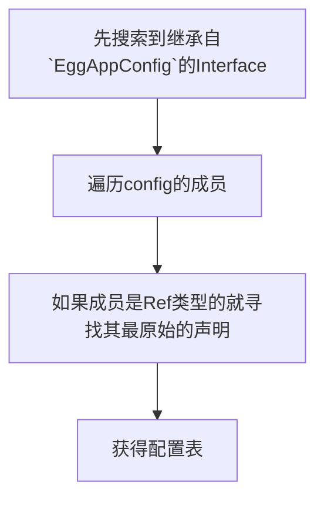
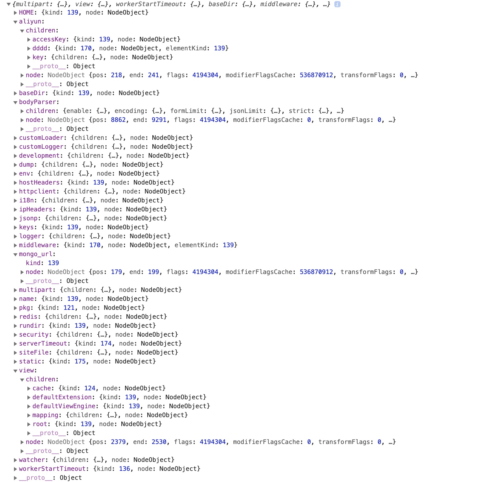
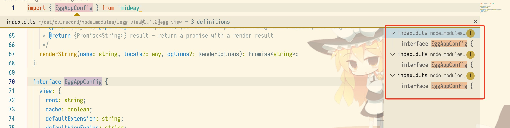

# Typescript解析器之Midway配置项读取

最近在使用 [Midway](https://midwayjs.org/midway/) 框架写一个小项目, 虽然装饰器在很多时候提供了非常多辅助作用, 但是用多了会发现一件事情, **很多的装饰器参数都是字符串**, 这就导致了编辑器完全没有办法做语法补全🤷‍♀️, 非常的蛋疼. 

为了缓解这个问题我打算写一个关于 Midway 框架的 `LSP`




<!--truncate-->

> 我这边使用的是 `ts-node` 调试的时候用是 `node --inspect -r ts-node/register &lt;filename.ts>

> 目前在找工作, 如果这家公司用的是 midway 我就把这个插件补完, 发布出来并补上其他功能 😄

## 测试文件

首先为了编写的简单, 先约定在`src/config/config.d.ts` 里面一个 继承 `EggAppConfig` 结构的声明

```typescript
import { EggAppConfig } from 'midway'

import AliyunConfig from './aliyun.ts'

export interface RedisUrl {
  redis_url: string
}

export interface MyProjectConfig extends EggAppConfig {
  mongo_url: string
  redis: RedisUrl,
  aliyun: AliyunConfig
}
```

```typescript
// 这个是上面 `aliyun.ts` 的文件
export default interface AliyunConfig {
  accessKey: string
  key: {
    ddd: string
  },
  dddd: string[]
}

```

效果



## 初始化 Typescript 的 LanguageService

这个不多说, 不知道的看 ts 的文档,  那个文件的地址就是我们约定的 types 的存放位置, 可自己计算出来, 当然搜索也是没问题的 

```typescript
import * as ts from "typescript";
import * as fs from 'fs'

const files: ts.MapLike<{ version: number }> = {};
const rootFileNames: string[] = ["/Users/haozi/cat/cv_record/src/config/config.d.ts"];
// initialize the list of files
rootFileNames.forEach(fileName => {
    files[fileName] = { version: 0 };
});

// Create the language service host to allow the LS to communicate with the host
const servicesHost: ts.LanguageServiceHost = {
    getScriptFileNames: () => rootFileNames,
    getScriptVersion: fileName =>
        files[fileName] && files[fileName].version.toString(),
    getScriptSnapshot: fileName => {
        if (!fs.existsSync(fileName)) {
            return undefined;
        }

        return ts.ScriptSnapshot.fromString(fs.readFileSync(fileName).toString());
    },
    getCurrentDirectory: () => process.cwd(),
    getCompilationSettings: () => ({}),
    getDefaultLibFileName: options => ts.getDefaultLibFilePath(options),
    fileExists: ts.sys.fileExists,
    readFile: ts.sys.readFile,
    readDirectory: ts.sys.readDirectory
};

// Create the language service files
const services = ts.createLanguageService(
    servicesHost,
    ts.createDocumentRegistry()
);

(global as any).ts = ts;
(global as any).services = services; // 调试需要, ts编译之后, 如果程序执行完毕, 作用域就访问不到了, 调试用!!!
```


## 搜索继承自`EggAppConfig`的 interface

遍历整个文件的节点, 如果找到了 interface 类型的, 那么就看他有没有继承, 如果又继承就看他的继承里面有没有一个叫做 EggAppConfig

```typescript
function searchEggConfigNode(source: ts.SourceFile) {
    let configNode = null;
    ts.forEachChild(source, (node) => {
        if (ts.isInterfaceDeclaration(node)) {
            if (node.heritageClauses) {
                node.heritageClauses.forEach((dnode) => {
                    dnode.types.forEach(_node => {
                        if ((_node.expression as ts.Identifier).escapedText === 'EggAppConfig') {
                            configNode = node;
                        }
                    })
                });
            }
        }
    })
    return configNode;
}
```


## 搜索到 Config 节点之后, 遍历节点

遍历节点的时候, 针对不同的类型做不同的处理是, 这里写的有点粗糙, 可能有点细节没有考虑到,比如带复杂类型的数组(没处理)

* 如果是 Interface 类型的数据, 就先寻找他的父类, 然后再计算他的成员
* 如果已经是 `PropertySignature`那么就记录他的 kind 和名字, [跳转](#xun-zhao-shen-ming-de-zhen-shi-wei-zhi)
* 如果是 `TypeReference`的类型, 就要去寻找他的真实的定义,和位置
* 如果 kind 的是 `TypeLiteralNode` 说明是一个数组结构, 需要记录为数组 并且记录他的类型

```typescript
function mapConfig(configNode: ts.Node, config: Object = {}) {
    if (ts.isInterfaceDeclaration(configNode)) {
        if (configNode.heritageClauses && configNode.heritageClauses.length > 0) {
            configNode.heritageClauses.forEach(node => {
                Object.assign(config, mapConfig(node, {}))
            })
        }
        if (configNode.members) {
            configNode.members.forEach((member) => {
                Object.assign(config, mapConfig(member, {}))
            })
        }
    }

    if (ts.isPropertySignature(configNode)) {
        if (configNode.type.kind === ts.SyntaxKind.TypeReference) {
            findDefinition(configNode).forEach(definition => {
                Object.assign(config, {
                    [configNode.name.getText()]: {
                        children: mapConfig(definition, {}),
                        node: configNode
                    }
                })
            })
        } else {
            
            config[configNode.name.getText()] = {
                kind: configNode.type.kind,
                node: configNode
            }

            if (ts.isArrayTypeNode(configNode.type)) {
                config[(configNode.name as ts.Identifier).text].elementKind = (configNode.type as ts.ArrayTypeNode).elementType.kind
            }


            if (ts.isTypeLiteralNode(configNode.type)) {
                    Object.assign(config, {
                        [configNode.name.getText()]: {
                            children: mapConfig(configNode.type, {}),
                            node: configNode.type
                        }
                    })
            }
        }
    }

    if (ts.isImportDeclaration(configNode)) {
        findDefinition(configNode).map(definition => {
            return mapConfig(definition, {})
        }).forEach(v => {
            Object.assign(config, v)
        })
    }
    
    if (ts.isHeritageClause(configNode)) {
      	// 这里因为是测试用的, 所以三个 EggAppConfig 都返回合并, 不论对错
        findDefinition(configNode).map(definition => {
            return mapConfig(definition, {})
        }).forEach(v => {
            Object.assign(config, v)
        })
    }

    if (ts.isTypeLiteralNode(configNode)) {
        configNode.members.forEach(member => {
            Object.assign(config, mapConfig(member, {}))
        })
    }

    return config;
}
```


## 寻找申明的真实位置

很多时候都会遇到这个蛋疼的问题, ts 的 `getDefinitionAtPosition`的这个函数并不准确, 比如搜索`EggAppConfig`的 ImportDeclaration, 会返回给你 3 个定义,分别是 

* egg
* egg-view
* egg-multipart



 实际上你阅读以下源码可以清楚的知道是`egg`包里面的定义, 但是这玩意就给你返回了 3 个, webStorm 是 0 个 (MDZZ)

这里只是测试代码, 所以选择三个都返回, 在mapConfig 里面也是 3 个都合并

```typescript
// 辅助函数, 用于返回指定 fileName 的 sourceFile, 这里是遍历 Program 的 SourceFileS, 防止用到不是本项目的文件
function findSourceFile(program: ts.Program, fileName: string): ts.SourceFile {
    for (const file of program.getSourceFiles()) {
        if (file.fileName === fileName) {
            return file;
        }
    }
    return undefined;
}


function findDefinition(node: ts.Node): any[] {
    let pos = 0;
    // ts 这玩意可以多继承, 懒得管他只取第一个
  	// pos 指的是节点开始的位置, + 1 的意思是让位置指向节点的第一个字母结束的位置, getDefinitionAtPosition这个函数必须 pos 在搜索的关键字上面, 不能是前面
    if (ts.isHeritageClause(node)) {
        pos = node.types[0].pos + 1;
    }
    if (ts.isPropertySignature(node)) {
        pos = node.type.pos + 1
    }
    const definitions = services.getDefinitionAtPosition(node.getSourceFile().fileName, pos);
    if (definitions && definitions.length > 0) {
      // 如果搜到了选择, 就都返回
        return definitions.map(definition => {
            const source = findSourceFile(program, definition.fileName);
            return findNodeAtPos(source, definition.textSpan.start - 1);
        })
    }
    return [];
}
```

`getDefinitionAtPosition`只会返回一个这样的数据结构

```json
{
    "fileName": "/Users/haozi/cat/cv_record/node_modules/midway/node_modules/midway-web/node_modules/egg/node_modules/egg-multipart/index.d.ts", // 文件位置
    "textSpan": {  // 开始位置
        "start": 2208,
        "length": 12
    },
    "kind": "interface",  // 类型
    "name": "EggAppConfig",  // 名称
    "containerName": "\"egg\"",
    "contextSpan": {
        "start": 2198,
        "length": 458
    }
}
```

所以我们需要吧 文件名, 位置, 拿去再搜索一次, 由于 `ts.forEachChild` 只能遍历一层, 增加了辅助函数遍历深层的Node,即 如果还有子节点就递归调用 deepNodeMap 直到没有子节点为止,  对比的时候要注意

* 如果是 Interface 类型的数据, 那么就去读取他的 `name.pos`
* 如果是普通的直接对比 `pos` 数据即可

```typescript
// 数组拍平
const flattenDeep = (arr): any[] => Array.isArray(arr)
  ? arr.reduce( (a, b) => a.concat(flattenDeep(b)) , [])
  : [arr]

// 深遍历
function deepNodeMap<T extends ts.Node>(nodes: T[], callback: (node: T) => void, res: any[] = []): any[] {
    if (nodes.length > 0) {
        return flattenDeep(nodes.map((value) => {
            if (value.getChildCount() > 0) {
                return [callback(value), deepNodeMap(value.getChildren(), callback, res)];
            } else {
                return [callback(value)]
            }
        })).filter(_ => _)
    }
    return res;
}

// 寻找文件中 pos 位置的节点
function findNodeAtPos<T extends ts.Node>(sourceFile: ts.SourceFile, pos: number): T[] | null {
    const res = deepNodeMap(sourceFile.getChildren(), node => {
        if (ts.isInterfaceDeclaration(node)) {
            if (node.name.pos === pos) {
                return node as any as T;
            }
        } else {
            if (node.pos === pos) {
                return node as any as T;
            }
        }
    })

    // 这里返回第一个的原因是, 上面的判断在一个 Interface 中可能都会命中, 只需要第一个就行,
    // 比如搜索 EggAppConfig 中会返回 [NodeObject, IdentifierObject], 这里的
    // NodeObject 是 interface 的 Node, 而 IdentifierObject 是 EggAppConfig 这个定义的 Node
    // 所以如果先搜索到了 Interface 的 Node, 就选第一个
    return res[0]
}
```

拿到了准确的位置信息和 Node 节点, 然后在 mapConfig 函数里面递归就行了

## 结束

如果拿到了这份配置表, 梳理一下结构, 非常容易的就可以根据输入的字符预测用户需要完成的配置项, 并且可以提前将 `private | <Type>` 这种结构帮他写好. 包括其他的 `Service`,`Controller`,`Middleware`都是同理, 搜索对应的就行


## 参考文档

[1]:[microsoft/TypeScript - Using the Compiler API]( https://github.com/Microsoft/TypeScript/wiki/Using-the-Compiler-API)
