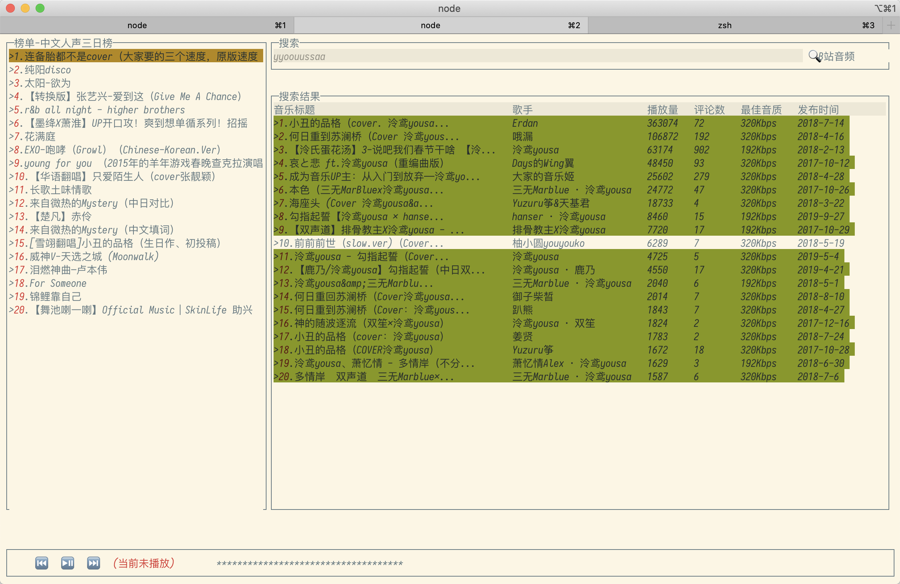

# bilibili 音频区 API 文档

最近在做一个在终端可使用的音频播放器用来听 Bilibili 音频区的歌曲(网易云🌶🐔), 但是莫得接口文档, 所以自己抓一下

没做完的界面(康明宋)

<!--truncate-->

## 在线文档

[POSTMAN](https://documenter.getpostman.com/view/5544411/SW14VcqT?version=latest)

这里面整理了大部分的获取信息的接口, 并对部分需要鉴权的接口存储了一份带有本人身份信息请求的example

## 部分接口说明

关于权限先说几点

* 大部分的 `GET` 接口都是不需要鉴权的
* 大部分的 `privilege` 参数也不鉴权, 客户端传啥是啥
* 比如 `我的信息` 这种接口可以获取任何人的 VIP 过期时间

其他的貌似没啥说的了, 有问题留言~
