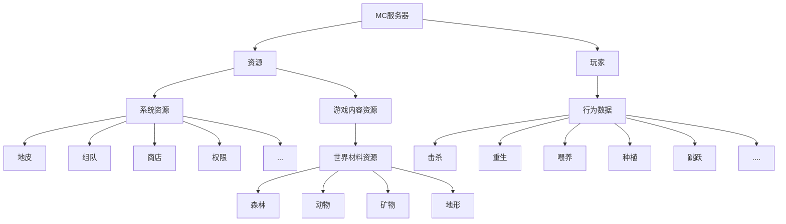
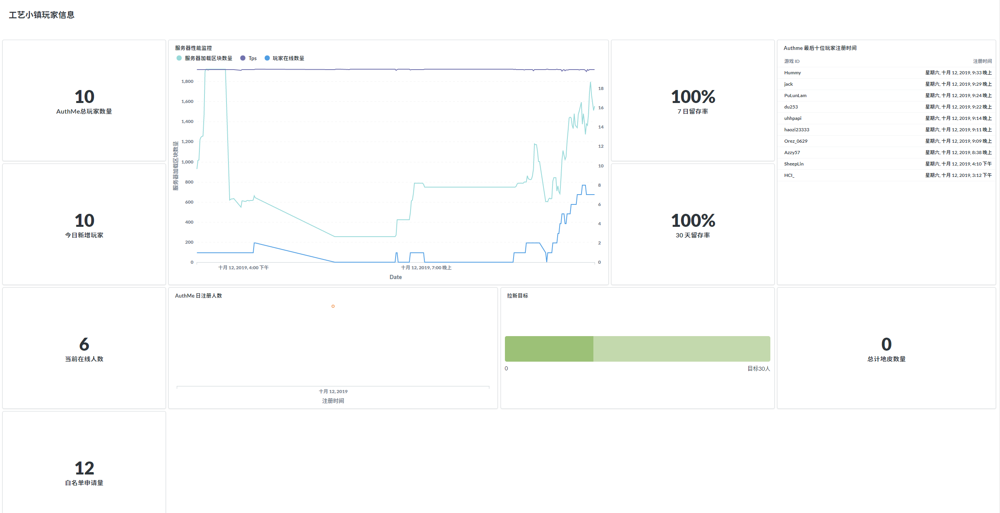
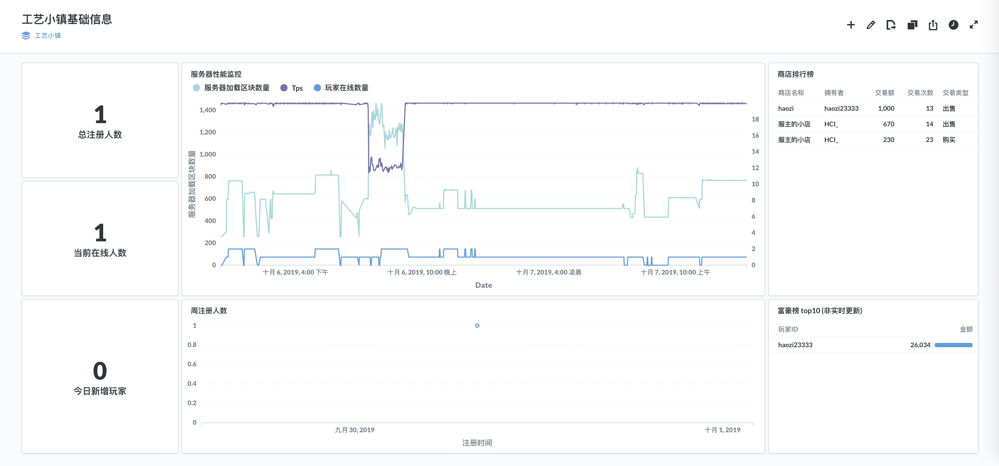

# metabase统计MC服务器信息

[Metabase](https://www.metabase.com/)是一个非常常见的免费的开源 BI 产品, 界面也比较的好看

最近朋友的新服正在筹划中(暑假说 9 月 1,  之后说国庆, 现在说本月, 咕咕咕),  协助其将一部分资源解决后, 现在我没啥事情做, 针对其游戏内的一些数据统计, 化身**产品经理**, 打算对一些数据进行分析, 做一个 Dashboard


<!--truncate-->


## MC 游戏数据分类

MC 服务器所有的可以进行操作的东西都是资源, 而玩家和这些资源产生交互就会有行为数据,  下面是一个我认为的基础分类



但是有一个很操蛋的事情, 作为一个 BI 工具, 只能读取数据库进行一些数据的分析, 游戏产生的数据如何进入数据库呢?


## 收集信息

基本都是选一些可以搭配数据库进行使用的插件

### 插件

* [crafttown 机器人](https://github.com/haozi23333/kuQforNodeJSPlugin/) 用于群内玩家注册, 管理白名单

*  [Plan | Player Analytics](https://www.spigotmc.org/resources/plan-player-analytics.32536/) [GitHub](https://github.com/plan-player-analytics/Plan)  一个上报服务器信息的插件, tps, 内存, 实体数量,....  (虽然自带一个管理面板, 但是没啥卵用)
* [Essentials MySQL Storage Extension](https://www.spigotmc.org/resources/essentials-mysql-storage-extension.25673/)  (同步 ESS 的玩家数据, 但是 money 这种玩意, 玩家下线的时候才会会同步一次)

* [MySQL Player Data Bridge](https://www.spigotmc.org/resources/mysql-player-data-bridge.8117/)   玩家数据同步 ( 这玩意腐竹说会有可能玩家背包清空 ?????, 暂时没用)

* [plotme](http://plotme.worldcretornica.com/)  地皮
* [Taobao](https://www.mcbbs.net/thread-876012-1-1.html)  淘宝商城, 类似环球市场
* [CoreProtect](https://www.spigotmc.org/resources/coreprotect.8631/) 对世界资源的操作记录, 用于回档等
* [Authme](https://www.spigotmc.org/resources/authmereloaded.6269/) 注册登录插件
* .....

但是比如一些老牌的好用的插件没有提供 Mysql 数据库的支持, 但是后期可以考虑其他方式进行一些获取, 比如写一个服务去读取他存在本地的 yml, 同步到数据库再进行分析

* [Residence](https://dev.bukkit.org/projects/residence) 领地插件
* ....


虽然使用了这些插件, 但是还是有很多的维度没有统计到. 后期对玩家的一些行为分析, 就需要自己写插件去统计了, 


## 部署 Metabase - k8s

先下载 `https://raw.githubusercontent.com/helm/charts/master/stable/metabase/values.yaml` 

修改其中 `Backend database` , 默认是 h2 没做数据持久化 (忘记改被坑了一次),

安装

```sh
helm install --name my-release stable/metabase --values=values.yaml
```

创建 ingress

```yaml
apiVersion: extensions/v1beta1
kind: Ingress
metadata:
  name: metabase-ingress
spec:
  tls:
  - hosts:
    - metabase.haozi.local
    secretName: haozi.local-ssl
  rules:
  - host: metabase.haozi.local
    http:
      paths:
      - path: /
        backend:
          serviceName: crafttown-metabase-metabase
          servicePort: 3000
```


## 分析

### 玩家数据

这里使用的是 Authme 的表进行一个分析, 实际上这个是缺点东西的, 比如玩家每次登陆的时间, 所以有些留存率只能大概的分析一下, 里面的 world 字段其实是登陆点(下线的位置)的位置, 而不是玩家现在所在的位置,  所以要统计世界玩家数量得自己写个东西

* 总计玩家数量
* 今日新增
* 7 日留存
* 30 日留存
* 拉新目标
* 最后注册玩家时间
* 当前在线数量



<center>等玩家入驻之后, 替换为真实数据</center>

### 服务器数据

比如地皮, 商城, 数据很贫瘠, 没啥要统计了

* 地皮数量 (总数量就行, 不用 X 日多少)

* 商城交易量信息 (当日即可)

* TPS 等数据 (plan 插件给的, 这个 CPU 占用指的是 HOST 的, 统计不对)

  



<center>等玩家入驻之后, 替换为真实数据</center>

## 后

总之来说这写数据真的是过于贫瘠, 最近内网的 elasticsearch + kibana 已经搭好了, 如果上线之后玩家比较多, 可以产生比较多的数据量的时候, 就可以写一个插件自己采集数据丢 ES 里面, 进行一个行为分析, 还可以练习 ES(美哉, 


