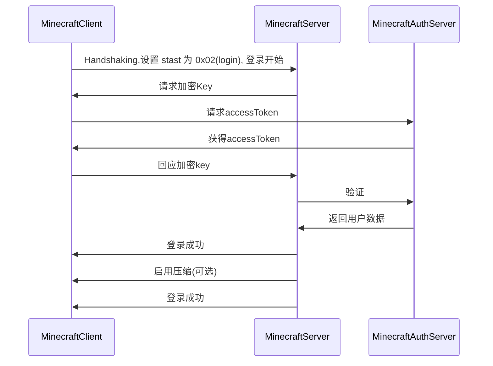

# Minecraft协议解析[1]
最近还是接触Minecraft比较多, 从头理清一下服务端, 造一个高性能, 分布式的 Minecraft的轮子


​	<center>haozi23333 的 头</center>

<!--truncate-->


## 数据包格式

简单的拿这个握手包来说明
`<Buffer 10 00 f2 03 09 31 32 37 2e 30 2e 30 2e 31 63 dd 01>`

<table>
<thead>
<tr>
<th> Packet ID
</th>
<th> State
</th>
<th> Bound To
</th>
<th> Field Name
</th>
<th> Field Type
</th>
<th> Notes
</th></tr></thead>
<tbody>
<tr>
<td rowspan="4"> 0x00
</td>
<td rowspan="4"> Handshaking
</td>
<td rowspan="4"> Server
</td>
<td> Protocol Version
</td>
<td> VarInt
</td>
<td> See <a href="" title="Protocol version numbers">protocol version numbers</a> (currently 498 in Minecraft 1.14.4)
</td></tr>
<tr>
<td> Server Address
</td>
<td> String (255)
</td>
<td> 主机名或IP，例如
用于连接的localhost或127.0.0.1。
Notchian服务器不使用此信息。
请注意，SRV记录是完整的重定向，例如
如果_minecraft._tcp.example.com指向mc.example.org，则连接到example.com的用户除了连接到mc.example.org外，还将提供mc.example.org作为服务器地址。
</td></tr>
<tr>
<td> Server Port
</td>
<td> Unsigned Short
</td>
<td> 默认值为25565。Notchian服务器不使用此信息。
</td></tr>
<tr>
<td> Next State
</td>
<td> VarInt Enum
</td>
<td> 1  请求状态 2 登录流程
</td></tr></tbody></table>


> 其他的结构参看参考资料1 


```
`
                                                服务器端口(Usingned Short)
        PacketID(Varint)                             |
           |  Protocol Version                       |
           |  |---| --(Server Address Length)     -----
<Buffer 10 00 f2 03 09 31 32 37 2e 30 2e 30 2e 31 63 dd 01>
		|              --------------------------       |
	数据包长度(Varint)             |                  下一步状态(VarInt)
                               服务器地址(String)                 
```
根据读取计算

|            | 原始数据                                                    | 解析后        |
| ---------- | ----------------------------------------------------------- | ------------- |
| 数据包长度 | 0x10                                                        | 16            |
| 数据包ID   | 0x00                                                        | 0:Handshaking |
| 服务器地址 | 0xf2 0x03 0x09 0x31 0x32 0x37 0x2e 0x30 0x2e 0x30 0x2e 0x31 | 127.0.0.1     |
| 服务器端口 | 0x63 0xdd                                                   | 25565         |
| 下一步动作 | 0x01                                                        | 1: 请求状态   |

> 如果是已经 加密了的数据, 请先解密, 然后按照格式进行处理, 
>
> 如果是已经 启用了压缩了的数据, 请先解压缩然后再解密, 然后按照格式进行处理,

> 握手之后的PING包, 可能会被利用来攻击, 如果单个socket短时间内被ping次数太多, 就关闭socket然后拉黑

## 读取握手包的例子(Rust)

```toml
[dependencies]
tokio = "0.2.0-alpha.6"
mc-varint = "0.1.1"
bytes="0.4.7"
```

```rust
use tokio::net::TcpListener;
use tokio::prelude::*;
use std::net::SocketAddr;
extern crate mc_varint;
use mc_varint::{VarInt, VarIntRead};
use bytes::Buf;
use std::io::Cursor;

#[tokio::main]
async fn main() -> Result<(), Box<dyn std::error::Error>> {
    let addr = "127.0.0.1:25565".parse::<SocketAddr>()?;
    let mut listener = TcpListener::bind(&addr).await?;

    loop {
        let (mut socket, _) = listener.accept().await?;

        tokio::spawn(async move {
            let mut buf = [0; 1024];

            // In a loop, read data from the socket and write the data back.
            loop {
                let n = match socket.read(&mut buf).await {
                    // socket closed
                    Ok(n) if n == 0 => return,
                    Ok(n) => n,
                    Err(e) => {
                        println!("failed to read from socket; err = {:?}", e);
                        return;
                    }
                };
                parser_package(buf);
                // Write the data back
                if let Err(e) = socket.write_all(&buf[0..n]).await {
                    println!("failed to write to socket; err = {:?}", e);
                    return;
                }
            }
        });
    }
}


fn parser_package(buf: [u8;1024]) {
    let mut vector = Cursor::new(buf.to_vec());
    vector.set_position(0);
    let package_length = i32::from(vector.read_var_int().unwrap());
    let package_id = i32::from(vector.read_var_int().unwrap());
    println!("数据包长度 {}", package_length);
    println!("数据包 ID  {}", package_id);


    match package_id {
        0 => {
            println!("开始握手 {}", package_id);
            let client_protocol_verison = i32::from(vector.read_var_int().unwrap());
            let server_address_length = i32::from(vector.read_var_int().unwrap());
            let mut server_address = String::new();
            server_address = String::from_utf8(buf[vector.position() as usize..(vector.position() + server_address_length as u64) as usize].to_vec()).unwrap();
            vector.set_position(vector.position() +  server_address_length as u64);
            let server_port = vector.get_u16_be();
            let client_state = i32::from(vector.read_var_int().unwrap());

            println!("客户端版本 {} 服务器地址 {} 服务器端口 {} 状态 {}", client_protocol_verison, server_address, server_port, match client_state {
                1 => "查询状态",
                2 => "登录",
                _ => "未知"
            } )
        },
        _ => println!("未知的数据包ID {}", package_id),
    }
}

```

```sh
数据包长度 16
数据包 ID  0
开始握手 0
客户端版本 498 服务器地址 127.0.0.1 服务器端口 25565 状态 查询状态
```


## 登录时序图



> 如果不是正版登录, 就不需要AccessToken的步骤

## 参考资料

[1]: [Minecraft 协议](https://wiki.vg/Protocol): https://wiki.vg/Protocol
