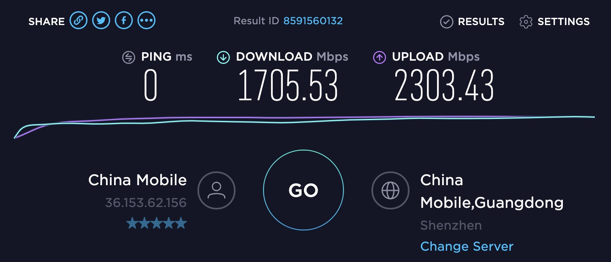

# speedtest欺骗

昨天在知乎上面刷到了一篇文章 [测速真的靠谱吗？揭秘运营商的猫腻](https://zhuanlan.zhihu.com/p/82105234) , 这个讲的是运营商自己搭建了 speedtest 的服务器对用户测速的请求进行了拦截, 使用户访问的测速服务器为运营商内网的. 从而网速造假.




<!--truncate-->


## 抓取测速节点地址

这个 F12 直接看就行, 比如`China Mobile GuangDong(Shenzhen)`的地址为 `https://speedtest3.gd.chinamobile.com.prod.hosts.ooklaserver.net:8080`要注意是否是 https 协议, 如果是 https 协议需要自己签发相对应的 ssl 证书

然后修改 hosts 将这个地址指向 `127.0.0.1`,

##  安装 OoklaServer 客户端

> 官方文档 [OoklaServer Installation - Linux / Unix](https://support.ookla.com/hc/en-us/articles/234578528-OoklaServer-Installation-Linux-Unix)

如果只是临时跑一次建议 使用二进制直接启动(参考官方文档下面的手动安装) [下载地址(官方)](https://install.speedtest.net/ooklaserver/stable/OoklaServer.tgz)

* 解压之后把目录下面的 `OoklaServer.properties.default` 重命名为`OoklaServer.properties`

*  编辑内容

  * 比较重要的几个地方就是端口(默认 8080 不用改)

  * SSL 证书部分, 如果是 https 需要自己签证书并信任, 不是就不用(对应下方的`SSL Options`), `cert.pem`,` key.pem`放在相同目录即可

    

```
#
# This is a sample configuration file for OoklaServer
#

#
# OoklaServer Options
#

# The server listens to TCP port 5060 and 8080 by default. These ports are required for
# speedtest.net servers, although more can be added.
#
# For Speedtest Custom, this can be changed to other ports if desired; you will need to
# contact support to update your server record.
#
# At least one port is required for this setting.
#
OoklaServer.tcpPorts = 5060,8080

# The server listens to UDP port 5060 and 8080 by default. These ports are required for
# speedtest.net servers, although more can be added.
#
# For Speedtest Custom, this can be changed to other ports if desired; you will need to
# contact support to update your server record.
#
# At least one port is required for this setting.
#
OoklaServer.udpPorts = 5060,8080

# Uncomment to bind OoklaServer to IPv6
#
# OoklaServer.useIPv6 = true

# OoklaServer.allowedDomains allows you to limit access to your OoklaServer.
#
# The default ("*") allows all domains access.
# Uncomment to allow access from ookla.com, speedtest.net, and simply add your
# own domain(s):
#
# OoklaServer.allowedDomains = *.ookla.com, *.speedtest.net

OoklaServer.maxThreads = 512

# Enable auto updates (default)
#
# OoklaServer.enableAutoUpdate = true


#
# SSL Options
#

# Enable Let's Encrypt certificate generation (default)
#
 OoklaServer.ssl.useLetsEncrypt = true

# To use a custom certificate, create a certificate and private key and set the path to them here:
# (Note, this will disable Let's Encrypt certificate generation)
 openSSL.server.certificateFile = cert.pem
 openSSL.server.privateKeyFile = key.pem


#
# Logging Options
#

# Log to the Console
#
logging.loggers.app.name = Application
logging.loggers.app.channel.class = ConsoleChannel
logging.loggers.app.channel.pattern = %Y-%m-%d %H:%M:%S [%P - %I] [%p] %t
logging.loggers.app.level = information

# Log to files
#
#logging.loggers.app.name = Application
#logging.loggers.app.channel.class = FileChannel
#logging.loggers.app.channel.pattern = %Y-%m-%d %H:%M:%S [%P - %I] [%p] %t
#logging.loggers.app.channel.path = ${application.dir}/ooklaserver.log
#logging.loggers.app.level = information
```


启动`OoklaServer`即可

可以先访问你所配置的域名的 1080 端口是否正常的工作

## 实验

进去 speedtest.net 然后选择你所劫持的节点, 启动测速


可以随便截个图然后丢群里晒, 还可以直接录屏, 证明不是 PS 的, 如果你的是万兆网卡可以跑的更高, 我的笔记本受性能约束,跑不快
