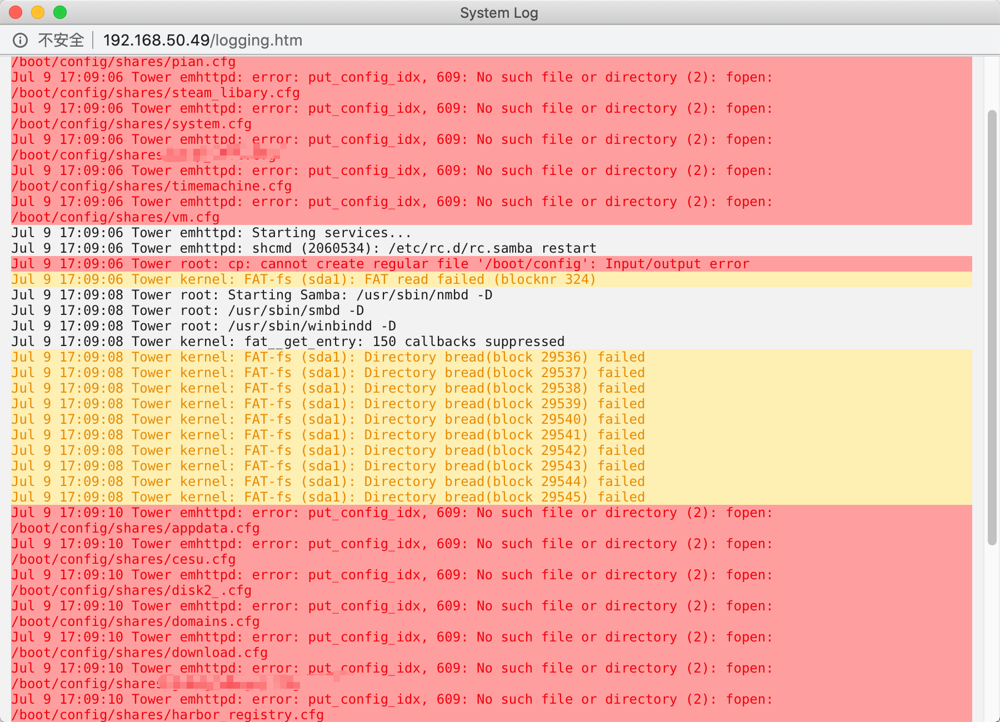

# 修复 Unraid 无法连接共享的问题

用着用着 SMB 突然连不上了, 重启服务器时间又巨长, 而且虚拟机也得重启 好麻烦. 所以还是得看看日志修修


<!--truncate-->

## 尝试重启 SMB

> SSH 连接方式: unraid web 界面 -> 右上角 -> 第二个图标

执行命令 `/etc/rc.d/rc.samba restart` 进行重启

提示:

```sh
root@Tower:~# /etc/rc.d/rc.samba restart
cp: cannot create regular file '/boot/config': Input/output error
Starting Samba:  /usr/sbin/nmbd -D
                 /usr/sbin/smbd -D
                 /usr/sbin/winbindd -D
```

淦, 我 U盘坏了???, 应该是我上次整理的时候不小心动了一下, 回去重新插入一下

## 重新挂载 /boot

重新插入一下 执行, `fdisk -l`

```sh
Disk /dev/sdf: 28.8 GiB, 30943995904 bytes, 60437492 sectors
Disk model: DataTraveler 3.0
Units: sectors of 1 * 512 = 512 bytes
Sector size (logical/physical): 512 bytes / 512 bytes
I/O size (minimum/optimal): 512 bytes / 512 bytes
Disklabel type: dos
Disk identifier: 0x00000000

Device     Boot Start      End  Sectors  Size Id Type
/dev/sdf1  *     2048 60437491 60435444 28.8G  c W95 FAT32 (LBA
```

找到了 U盘, 执行 `mount /dev/sdf1 /boot` (这里要替换为自己的)

## 再次重启 SMB

```sh
root@Tower:/boot# /etc/rc.d/rc.samba restart
Starting Samba:  /usr/sbin/nmbd -D
                 /usr/sbin/smbd -D
                 /usr/sbin/winbindd -D
```

这次就没报错了,  mac 和 window 的连接也正常了


## 其他

如果出现其他的错误异常啥的, 要记得经常去看看日志

> 日志打开方式:  unraid 右上角 -> 那排图标最后一个



不知道怎么处理的话, 就复制到 google 搜一下, 九成九就是已经发生过的问题了, 答案都可以找得到

