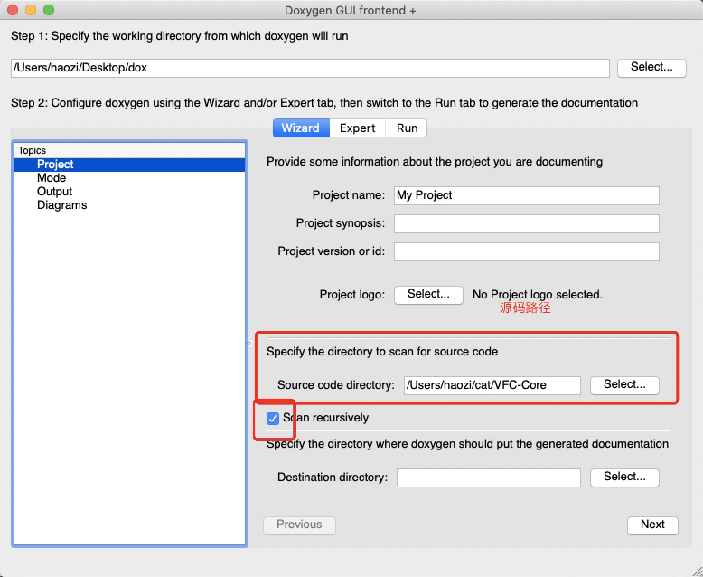
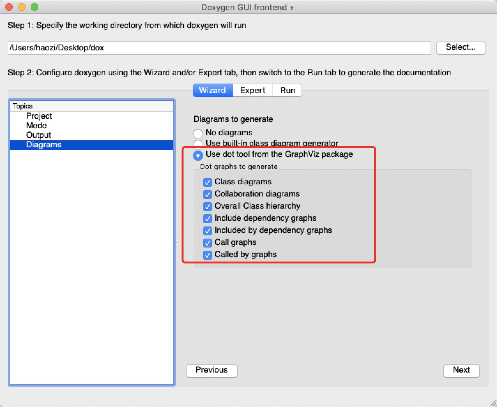
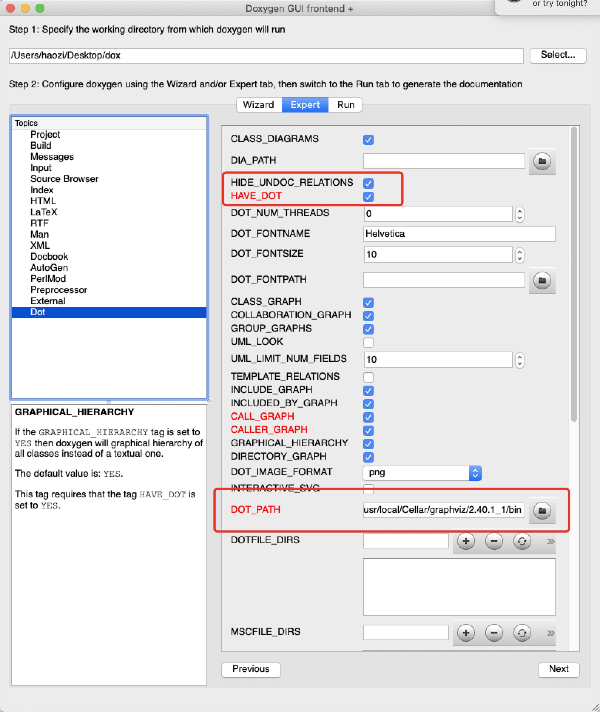
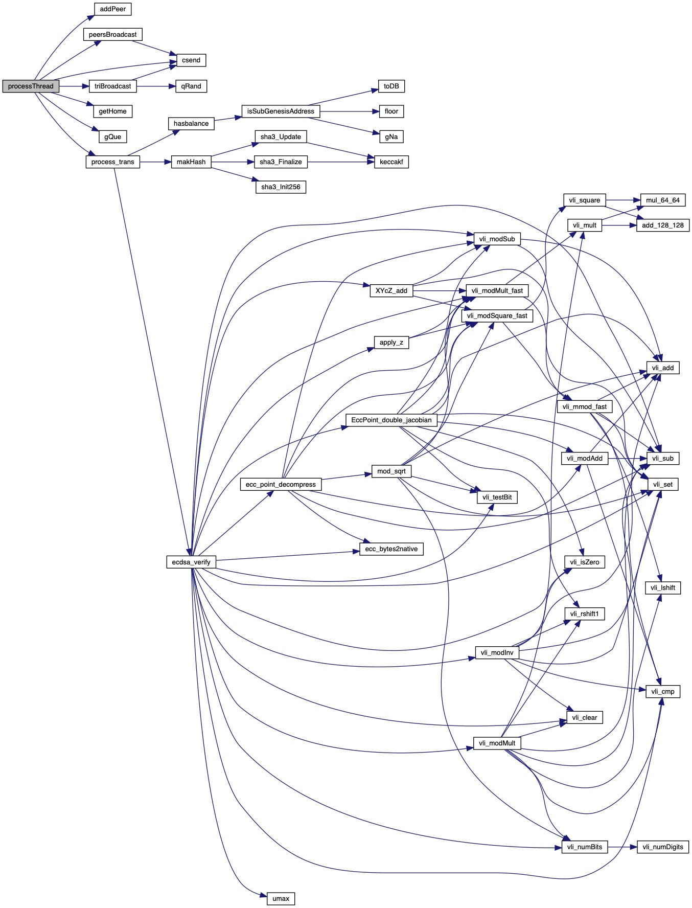

# 使用doxygen和graphviz生成函数调用流程图

方便阅读 C++代码


<!--truncate-->

## 安装 Doxygen

进入  http://www.doxygen.nl/download.html 页面, 下载安装即可


## 安装 graphviz

Mac 用户执行

```sh
brew install graphviz
```

我安装的时候遇到了一个问题

```sh
~ via ⬢ v8.14.0 at ☸️  kubernetes-admin@kubernetes took 6s
➜  brew install graphviz
Warning: You are using macOS 10.15.
We do not provide support for this pre-release version.
You will encounter build failures with some formulae.
Please create pull requests instead of asking for help on Homebrew's GitHub,
Discourse, Twitter or IRC. You are responsible for resolving any issues you
experience while you are running this pre-release version.

==> Installing dependencies for graphviz: python, glib, jasper, netpbm and gts
==> Installing graphviz dependency: python
Error: Your Xcode (10.3) is too outdated.
Please update to Xcode 11.0 (or delete it).
Xcode can be updated from:
  https://developer.apple.com/download/more/

```

我的 Xcode 版本有问题, 应该是我的系统是 `10.15 beta 8`的原因, 删除 xcode 或者更新 xcode 就可以继续安装下去了(这里我选择的是更新 Xcode 到 11)


## 配置

配置路径以及递归扫描





如果你是 brew 安装的 就是` /usr/local/Cellar/graphviz/<版本号>/bin`



点击生成, 进去函数里面就可以看到类似下发的图




## 参考

[用doxygen+graphviz生成函数调用流程图](https://www.jianshu.com/p/fe4b6b95dca5)

