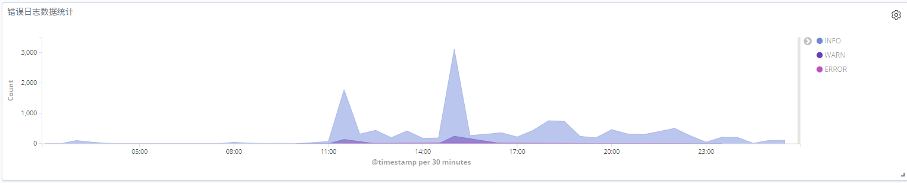

# 使用elk科学的分析Minecraft日志[2]

临时建立的监控大盘

上次将 Minecraft 服务器的日志用 logstash 导入到了 es 中,  使用的基本就是原生的日志, 数据点不是很多, 现在将这些有限的数据制作成图表**(一张图片胜过千万行日志)**

<!--truncate-->

## 性能数据

在上一篇文章中, logstash 配置里面解析了`lag / gc`, 和 `um tps` 这俩命令返回数据

分析这个就可以绘制出, 每个世界当前的 TPS, tick时间, 实体数量, tiles数量和chunk数量

以及每个世界各个指标的趋势

## 服务器数据

最基本的统计就是错误日志的统计

清理地图垃圾的插件信息(这个应该和tps放在一起分析, 但是这个20分钟才有一次数据 ==)

玩家被踢出服务器理由的统计

## 玩家数据

这里对 `chat`字段使用了 `IK分词`, 制作了根据玩家发言情况制作了 `cloud tag`

对热点命令进行一个统计

## 后

数据还是太少了, 目前在看 `Uranium`的源码, 准备自己吧 ES 集成到服务端的 log4j2 里面去, 

定时输出服务器的这些信息, 都会显示在控制台里面, 服里的技术员表示很难受, 而且目前为了最快的将日志同步到 logstash 里面去, 写文件采用的是立即刷新磁盘, 对性能影响比较大, 必须要优化为 异步提交

剩下的就是做好下面的数据收集

* 玩家行为数据
* 资源数据
