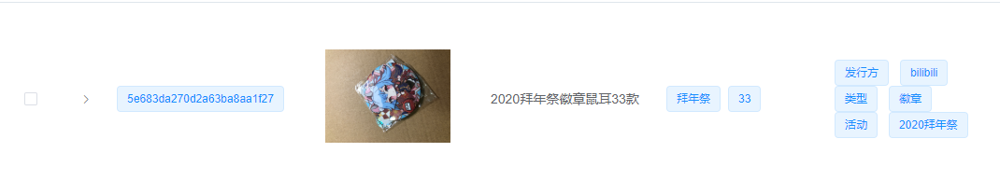

# 修复IOS上传图片方向问题

最近我在做一个自用的 WMS 系统,  在显示上传完毕的图片的时候遇到了一个问题,  图片莫名其妙被逆时针旋转了90度就很离谱


如下图





经过一番查询, 原来是 IOS 的相机拍照的时候会把方向角写入到图片里面

因为我用的是 element 的上传组件, 所以先去找了找  issue, 果不其然在 [Issues #15162](https://github.com/ElemeFE/element/issues/15162)有人和我提出了同样的问题, 官方给的回答是 `Sorry, we have no plan to support this.` 所以只能尝试自己修复了

<!--truncate-->


基础思路就是

* 获取图片的方向角
* 将图片在 `canvas` 画出
* 旋转到正常位置
* 导出为  `DataURL`
* `DataURL` 转换为 `File` 上传


## 获取旋转角

这里我们会用到 [exif-js](https://github.com/exif-js/exif-js) 这个库来获取图片的 orientation (方向角), 如果方向角不为 0 , 就需要吧方向角改回 0

先使用 `EXIF.getData` 解析图片, 然后 `EXIF.getTag` 拿到 `Orientation`返回, 为了调用方便都包装成 Promise

```javascript
import EXIF from 'exif-js'

async get_img_orientation(file) {
  return new Promise((resolve, j) => {
    EXIF.getData(file, function() {
      resolve(EXIF.getTag(this, 'Orientation'))
    })
  })
}
```

 

### Orientation  对照表

| Orientation 值 | 旋转角度 |
| :------: | :------------: |
| 1 | 0° |
| 6 | 顺时针90° |
| 8 | 逆时针90° |
| 3 | 180° |

这时候我们进行判断, 如果 Orientation  = 6 那么我们就进行下面的调整


## 调整图片

由于我们拿到的是 File 没法直接使用,  需要先变成 Image 对象

```javascript
async file_to_image(file) {
  return new Promise((resolve) => {
    const reader = new FileReader()
    const img = new Image()
    reader.onload = (e) => {
      img.src = e.target.result
      img.onload = function() {
        resolve(img)
      }
    }
    reader.readAsDataURL(file)
  })
}
```


> 下面的代码参考 [VUE uses element UI's upload component when ios uploads image rotation 90 degrees](http://www.programmersought.com/article/6665266668/), 有所修改


### 去除方向角

> 原作者这里是把图片旋转了, 这里只画出来去除了方向角

直接在画布上面画出来, 然后导出

```javascript
remove_orientation(image, width, height) {
  const canvas = document.createElement('canvas')
  const ctx = canvas.getContext('2d')
  canvas.width = width
  canvas.height = height
  ctx.drawImage(image, 0, 0)
  return canvas.toDataURL('image/jpeg')
}
```

### 转换为 file

从base64的DataURL, 去掉标记信息,  后面的数据用 atob 解码, 直接装到 Uint8Array

```javascript
dataURL_to_file(dataurl, filename) {
  const arr = dataurl.split(',')
  const mime = arr[0].match(/:(.*?);/)[1]
  const bstr = atob(arr[1])
  let n = bstr.length
  const u8arr = new Uint8Array(n)
  while (n--) {
    u8arr[n] = bstr.charCodeAt(n)
  }
  return new File([u8arr], filename, { type: mime })
}
```

这样就拿到了转换好的图片,  如果你喜欢可以 base64 直接上传


## 结合 Element UI

如果结合 Element UI 修改 Upload 的话, `before-upload` 这个函数是不能返回 一个修改后的file的, 所以我们使用 `http-request` 拦截上传函数来做

先添加一个 `:http-request="upload_file"`


```javascript
async upload_file(req) {
  let file = req.file
  const orient = await this.get_img_orientation(file)
  if (orient && orient === 6) {
    const img = await this.file_to_image(file)
    const data = this.remove_orientation(img, img.width, img.height)
    file = this.dataURL_to_file(data, file.name)
  }
  const payload = new FormData()
  payload.append(file.name, file)
  const id = await upload_file(payload) // 发送上传请求
  this.item.pictures.push(id[0]) // 添加到自己业务里面
}
```


## 后~
 = = IOS 上面权限系统好麻烦,  Chrome 也调用不了摄像头,  用了 `vue-qrcode-reader` 扫描二维码 识别率太低了,  要各种摆姿势, 微信上面基本秒扫,  有点考虑用小程序重做这部分了


## 参考引用

[1]: VUE uses element UI's upload component when ios uploads image rotation 90 degrees http://www.programmersought.com/article/6665266668/
