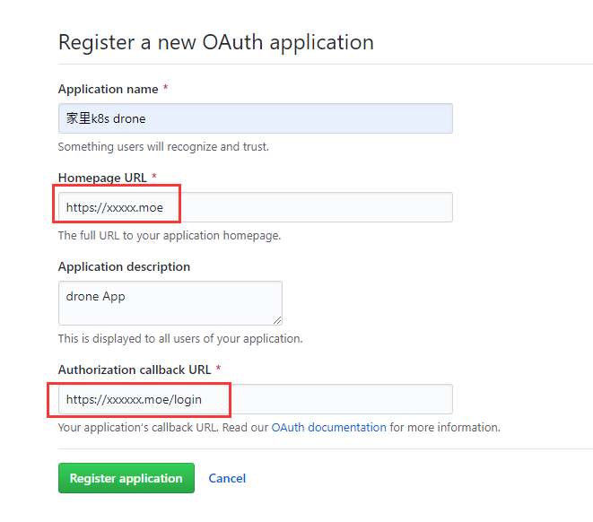
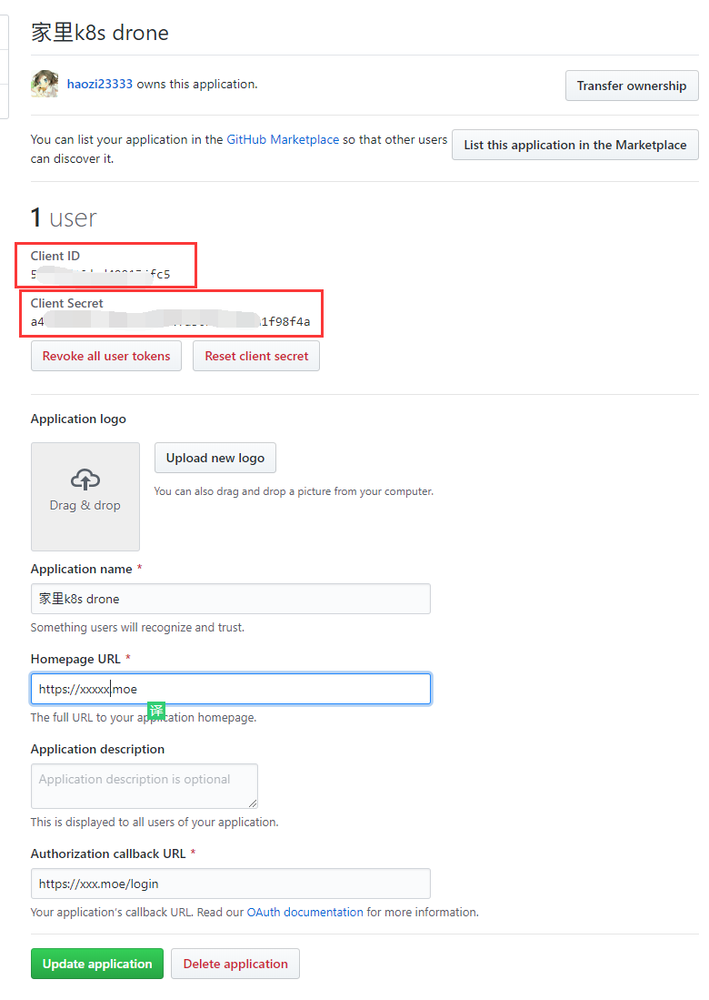
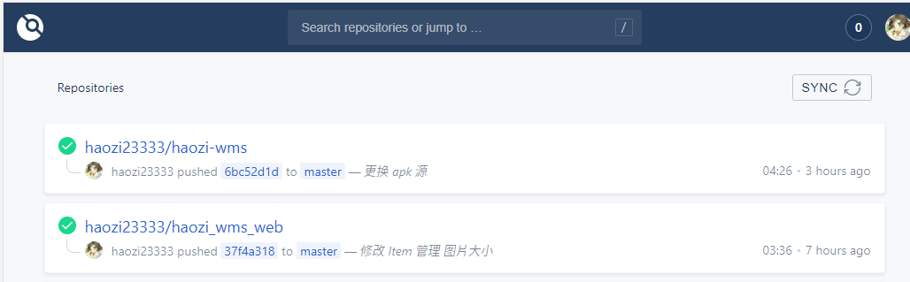
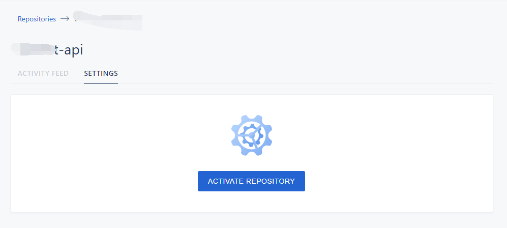
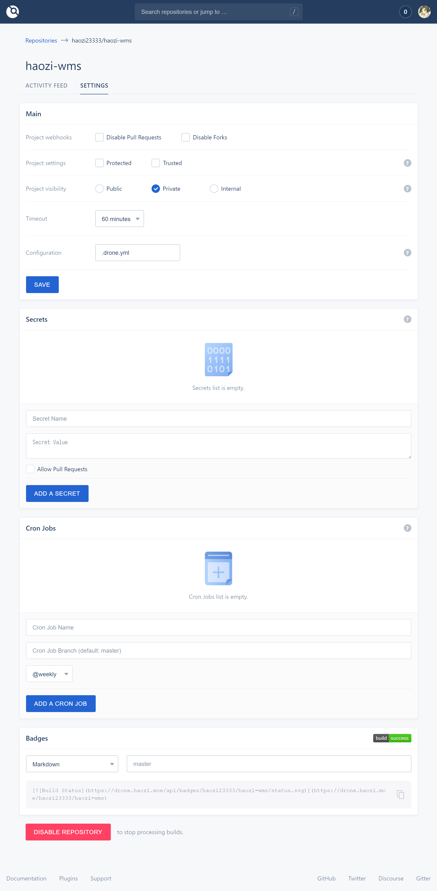
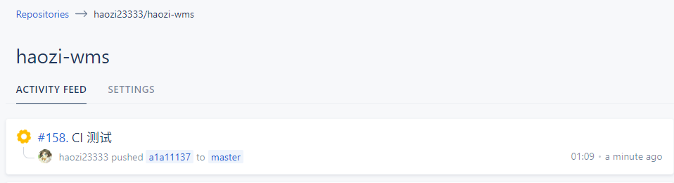
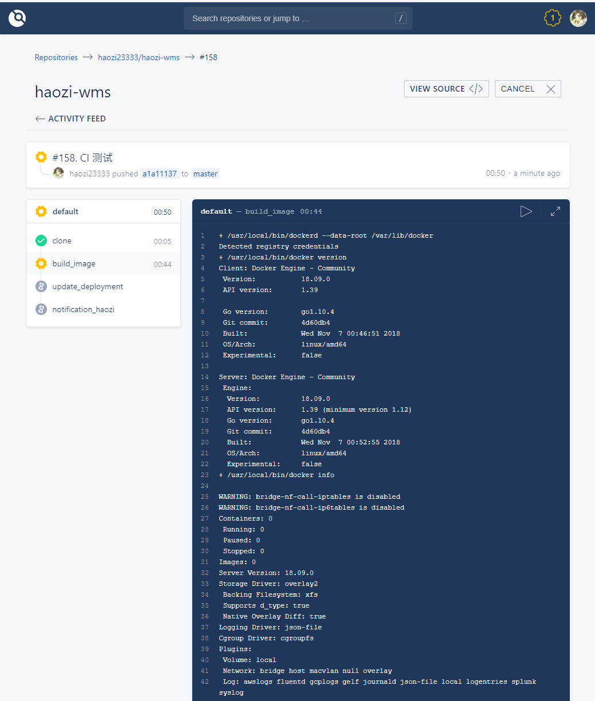
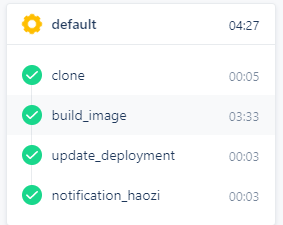
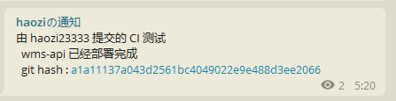

# 基于Github + Drone + K8s 构建私有 CI/CD 平台

最搬家收拾东西的是发现比起去年, 我的拥有的东西翻了个倍. 原来4个大箱子就打包完了, 现在8个才刚够. 我之前文章中提到我做了一个物品管理系统, 但是由于搬家的时候比较忙, 大部分的东西都没有统计进去.   

<br/>

正好马上到了五一, 想乘此机会把东西统计出来. 

<br/>

目前这个系统还在开发当中, 所以部署都是在自己的PC上面的, 使用的时候必须在 PC 启动然后 nginx 做 https 协议的反向代理, 手机浏览器才能正常的拍摄照片录入. 非常的麻烦, 所以借此机会想和内网的服务一起做一个整合.

<br/>

以前我的内网是有一个 gitlab 的, 但是由于太臃肿了, 再加上github 现在免费的无限量私有库, 非常的香. 就去掉了. `CI/CD` 工具开源的也没啥可以选的, 就老牌的 [`Jenkins`](https://www.jenkins.io/) 和新兴的 [`Drone`](https://drone.io/)这俩可选的, 以前公司用的就是 jenkins 总觉得太丑了,配置太麻烦了. 所以选了 Drone 来作死


<!--truncate-->

## 准备

* 搭建好的 K8s 集群 * 1
* Helm 3 * 1
* 镜像仓库 我用的是自建的 harbor, 你可以选择 阿里云, dockerhub 之类的

## 安装

下面是 github 作为代码仓库的安装方式, 如果需要其他的代码源请参考 [Drone Doc](https://docs.drone.io/)

参考 [drone chart](https://github.com/helm/charts/tree/master/stable/drone) 使用 helm 来安装, 主要修改以下内容

### Ingress 配置

```yaml
ingress:
  ## If true, Drone Ingress will be created.
  ##
  enabled: true

  # Drone Ingress annotations
  #
  annotations:
    kubernetes.io/ingress.class: nginx
    kubernetes.io/tls-acme: 'true'   # 我这里使用了 cert-manager 自动签发
    cert-manager.io/cluster-issuer: "letsencrypt-prod" # 签发机构
  # Drone hostnames must be provided if Ingress is enabled
  #
  hosts:
    - drone.haozi.cool # 域名
  # Drone Ingress TLS configuration secrets
  # Must be manually created in the namespace
  #
  tls:  # SSL 配置
    - secretName:  drone.haozi.cool-ssl 
      hosts:
        - drone.haozi.cool

```

### SourceControl

这部分按照,  [官方教程](https://docs.drone.io/server/provider/github/) 或者我的步骤来做

在github登录的状态下点击这里, [创建 Github OAuth Apps](https://github.com/settings/applications/new) 

按照提示填写, 其中的

*  `HomePage URL `是你的 drone 的地址(必须是公网)
* `Authorization callback URL` 是 drone 登录成功的回调地址(必须是公网)
  * 必须为 `/login` 结尾



点击创建后会到这里


将图上的 `Client ID` 和 `Client Secret` 填写到下面的配置中, `provider`选择 `github`

```yaml
sourceControl:
  ## your source control provider: github,gitlab,gitea,gogs,bitbucketCloud,bitbucketServer
  provider: github
  ## secret containing your source control provider secrets, keys provided below.
  ## if left blank will assume a secret based on the release name of the chart.
  secret:
  ## Fill in the correct values for your chosen source control provider
  ## Any key in this list with the suffix `Key` will be fetched from the
  ## secret named above, if not provided the secret it will be created as
  ## `<fullName>-source-control` using for the key "ClientSecretKey" and
  # "clientSecretValue" for the value. Be awere to not leak shis file with your password
  github:
    clientID: <clientID>
    clientSecretKey: clientSecret
    clientSecretValue: <clientSecretValue>
    server: https://github.com

```

修改地址 HOST 地址, (必须公网)

设置 `adminUser`为 你的github 名

设置 `kubernetes` 为 开启

```yaml
server:
  ## If not set, it will be autofilled with the cluster host.
  ## Host shoud be just the hostname.
  ##
  host: "drone.haozi.cool"

  ## protocol should be http or https
  protocol: http
  database:
    driver: "sqlite3"
    dataSource: "/var/lib/drone/drone.sqlite"
  logs:
    color: false
    debug: false
    pretty: false
    trace: false
    text: true

  ## http port
  ## Set to > 1024 if you want to run the pod as non-root user
  httpPort: 80

  ## rpcProtocol for rpc connection to the server should be http or https
  rpcProtocol: http

  ## Initial admin user
  ## Leaving this blank may make it impossible to log into drone.
  ## Set to a valid oauth user from your git/oauth server
  ## For more complex user creation you can use env variables below instead.
  adminUser: haozi23333

  ## Configures Drone to authenticate when cloning public repositories. This is only required
  ## when your source code management system (e.g. GitHub Enterprise) has private mode enabled.
  alwaysAuth: false

  ## Configures drone to use legacy kubernetes runner to run pipelines rather than agents
  ## if enabled will not deploy any agents.
  kubernetes:
    ## set to true if you want drone to use old kubernetes legacy to run pipelines
    enabled: true
    # you can run pipeline jobs in another namespace, if you choose to do this
    # you'll need to create that namespace manually.
    #namespace: drone-ci-pipeline
    # alternative service account to create to create drone pipelines. this account
    # will be given cluster-admin rights.
    # if not set the rights will be given to the default drone service account name.
    #pipelineServiceAccount: drone-ci-sa

```


### 安装

自行选择需要安装的 ns

```sh
helm install  stable/drone --generate-name -f  values.yaml  -n kube-ops
```


## 编写构建 Dockerfile 

由于我的项目是一个前后端分离的项目, API 和 Web 是两个不一样的 repo, 所以需要分开写


> 别急的到 drone 里面测试, 现在本地 docker build 通了再去测


### Web 项目构建

项目使用 Vue 编写, Dockerfile 使用多阶段构建

```dockerfile
# 从 node:13-alpine 开始打包
FROM node:13-alpine as builder

WORKDIR /usr/src/app

# 有个沙雕依赖, 需要 git, 先把阿里云源给他换上, 加速下载
RUN sed -i 's/dl-cdn.alpinelinux.org/mirrors.aliyun.com/g' /etc/apk/repositories
RUN apk update
RUN apk add git


# 先复制 package.json 和 package-lock.json
COPY package*.json ./

# 安装依赖
RUN npm install

# 复制剩余代码
COPY . .

# 构建 prod 的代码
RUN npm run build:prod


# 第二段用 nginx
FROM nginx:1.17.10-alpine as prod

# 从 builder 阶段复制 dist 目录到 /usr/share/nginx/html
COPY --from=builder  /usr/src/app/dist /usr/share/nginx/html

```

web 打包完成


### NodeJS API 构建

nodejs 使用了 node-canvas 来绘制标签图片, 所以需要安装一些额外的依赖.

```dockerfile
FROM node:13-alpine

# 安装 node-canvas 的依赖, 换源
RUN sed -i 's/dl-cdn.alpinelinux.org/mirrors.aliyun.com/g' /etc/apk/repositories
RUN apk update
RUN apk add --no-cache build-base g++ cairo-dev jpeg-dev pango-dev giflib-dev

WORKDIR /usr/src/app

# 和 web 打包一样
COPY package*.json ./
RUN npm install cnpm  -g --registry=https://registry.npm.taobao.org
RUN cnpm install

COPY . .

# 构建
RUN npm run build

# 容器运行的时候执行 node dist/src/main.js
CMD ["node", "dist/src/main.js"]
```

Nodejs 构建完成


## K8s 编排文件

我给我的这两个起了个名字 `haozi-api`  和 `haozi-web`

先编写 Deployment


### wms api deployment

主要设置一下

```yaml
apiVersion: apps/v1
kind: Deployment
metadata:
  name: wms-api-deployment
  namespace: haozi-app
spec:
  replicas: 1           # 最多一个
  minReadySeconds: 15   # 最小启动时间
  strategy:
    type: RollingUpdate  # 滚动更新
    rollingUpdate:  
      maxSurge: 1        # 滚动过程中, 最多可以创建pod数量
      maxUnavailable: 0  # 最多有多少个 pod 可以处于无法服务数量
  selector:
    matchLabels:
      app: wms-api-deployment
  template:
    metadata:
      labels:
        app: wms-api-deployment
    spec:
      containers:
      - name: wms-api
        image: harbor.haozi.cool/wms/haozi-wms-api:c395442635b9f24238174423f49070ee5b058b37   ## 设置初始镜像
        resources:
          limits:
            memory: "256Mi"    # 限制 内存, 根据你自己的应用来
            cpu: "500m"

        livenessProbe:         # 健康检查
            httpGet:
              path: /ping
              port: 3000
            initialDelaySeconds: 20
            periodSeconds: 3

        readinessProbe:         # 就绪探针 
            httpGet:
              path: /ping
              port: 3000
            initialDelaySeconds: 15
            periodSeconds: 15
        ports:
        - containerPort: 3000      # 暴露 3000 端口

```

### wms api service

```yaml
kind: Service
apiVersion: v1
metadata:
  name: wms-api-service
  namespace: haozi-app
spec:
  selector:
    app: wms-api-deployment
  ports:
    - protocol: TCP
      port: 80
      targetPort: 3000
```


### wms web deployment

```yaml
apiVersion: apps/v1
kind: Deployment
metadata:
  name: wms-web-deployment
  namespace: haozi-app
spec:
  replicas: 1           
  minReadySeconds: 15
  strategy:
    type: RollingUpdate
    rollingUpdate:  
      maxSurge: 1       
      maxUnavailable: 0
  selector:
    matchLabels:
      app: wms-web-deployment
  template:
    metadata:
      labels:
        app: wms-web-deployment
    spec:
      containers:
      - name: wms-web
        image: harbor.haozi.cool/wms/haozi-wms-web:3a9c31b6e5a4c7f116c02531b1d1c60aaa25927e
        resources:
          limits:
            memory: "256Mi"
            cpu: "500m"
        ports:
        - containerPort: 80
```

### wms web service

```yaml
kind: Service
apiVersion: v1
metadata:
  name: wms-web-service
  namespace: haozi-app
spec:
  selector:
    app: wms-web-deployment
  ports:
    - protocol: TCP
      port: 80
      targetPort: 80
```


### ingress

这里和 drone 一样 使用了  `cert-manager` 来签发证书

要注意下面的 `path`

因为需要吧 `wms.haozi.cool/api` 开头的所有请求转发到 api server. 所以开启了 `nginx.ingress.kubernetes.io/rewrite-target`, 然后才可以正则匹配

```yaml
apiVersion: extensions/v1beta1
kind: Ingress
metadata:
  annotations:
    cert-manager.io/cluster-issuer: letsencrypt-prod
    nginx.ingress.kubernetes.io/rewrite-target: /$1
  name: wms-ingress
  namespace: haozi-app
spec:
  tls:
  - hosts:
    - wms.haozi.cool
    secretName: wms.haozi.cool-ssl-prod
  rules:
  - host: wms.haozi.cool
    http:
      paths:
      - path: /api/(.*)
        backend:
          serviceName: wms-api-service
          servicePort: 80
      - path: /(.*)
        backend:
          serviceName: wms-web-service
          servicePort: 80

```


### 测试 编排

拿第二步 dockerfile build 出来的镜像都测试一下, 看看能不能跑通, 如果可以的话就可以开始编写下一步了

`kubectl apply -f xxxx.yaml -n haozi-app`


## 编写 Drone 配置

在上面的编排文件测试完成后, 进入 drone 界面




找到你的项目 点击




点击激活, drone 会自动在 repo 中添加一条 webhook, 可以在 github 项目中查看, 类似下图


回到 drone 进入项目, 一般来说不用动下面的配置, 有需要的话就微调一下




### .drone.yml

主要是分为3部分, 如果等我写好的话就是 四部分(加一个 测试)

下面是每个部分用到的 plugin 文档, 

* 构建镜像
  * [drone-docker 文档](http://plugins.drone.io/drone-plugins/drone-docker/)  
* 更新k8s
  * [drone-kubernetes 文档](http://plugins.drone.io/mactynow/drone-kubernetes/)
* 使用 TG 提醒构建是否完成 (你也可以使用别的插件, 推送到 钉钉, Slack, Server 酱之类的)
  * [drone-telegram](http://plugins.drone.io/appleboy/drone-telegram/)
* [Drone 环境变量参考](https://docs.drone.io/pipeline/environment/reference/)

以下是我使用的插件的配置, 以及注释

```yaml
kind: pipeline
name: default

steps:
  - name: build_image
    image: plugins/docker
    settings:
      username: <仓库账号>
      password: <仓库密码>
      dockerfile: Dockerfile # Dockerfile 的名字
      registry: <仓库地址>
      repo: harbor.haozi.cool/wms/haozi-wms-api # 仓库 Repo
      tags: ${DRONE_COMMIT_SHA}                 # 构建好的镜像的 TAG, 这里选择使用 git commit 的 hash

  - name: update_deployment
    image: quay.io/honestbee/drone-kubernetes
    settings:
      kubernetes_server: <K8s Endpoint>			 # k8s 集群地址
      kubernetes_token: <K8s token>              # 有权限部署的 k8s token
      namespace: haozi-app
      deployment: wms-api-deployment
      repo: harbor.haozi.cool/wms/haozi-wms-api   # 仓库 Repo
      container: wms-api                          # 容器名 
      tag:
        - ${DRONE_COMMIT_SHA}					# 需要被部署的镜像 TAG	
        
 # 其实上面这部分就是调用 k8s 的命令
 # kubectl -n <namespace> set image deployment/<deployment> <container>=<repo>:<tag>

  - name: notification_haozi
    image: appleboy/drone-telegram
    settings:
      token: <TG 机器人 token>        # TAG 机器人 token
      to: <TG 频道/用户 ID>			   # 向谁发信息	
      format: markdown              # 格式为 markdown
      message: >					# 需要发送的信息,  这里也可以使用 drone 里面的变量
        {{#success build.status}}
          由 ${DRONE_COMMIT_AUTHOR} 提交的 ${DRONE_COMMIT_MESSAGE}
          wms-api 已经部署完成
          git hash : [${DRONE_COMMIT_SHA}](${DRONE_COMMIT_LINK})
        {{else}}
          由 ${DRONE_COMMIT_AUTHOR} 提交的 ${DRONE_COMMIT_MESSAGE}
          wms-web 已经部署 失败!!!!!!!!
          git hash : [${DRONE_COMMIT_SHA}](${DRONE_COMMIT_LINK})
        {{/success}}


```

### 🐛

随便写点啥 , push 个 commit 上去激活一下




点进去看看




> 要注意这里的日志有些憨批, 不是实时更新的, 可能差的很远...,  有次到k8s容器调试错误, 发现这个页面的日志和 容器内的 build 日志, 差了一大截




<center>333333</center>

全部完成




TG也收到消息了

## 注意事项

> `.drone.yml` 千万要和 drone setting 里面的 Configuration 配置一样, 不然 Github Webhook 会一直提示   `Service Timeout`

> 自家家里网不好的话记得挂代理, 或者使用换源

> 记得一步步调试好最后再组装起来, 合起来调试比较麻烦

