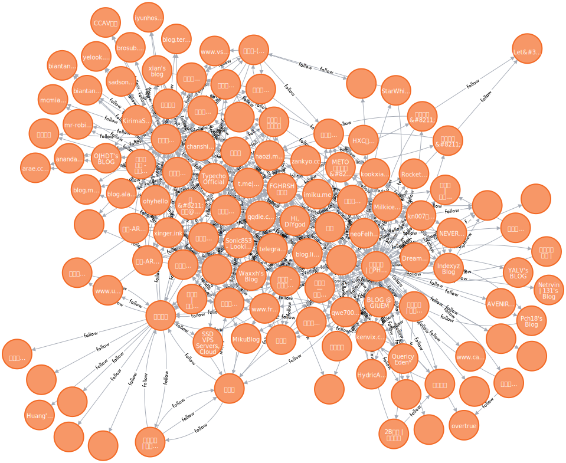

# 抓取博客之间的友链分析

最近还在找工作, 也蛮无聊的, 随便写点啥有意思的, 突然回想起以前想把各位大佬的博客友链抓一抓, 做一个博客排名, 分析一下有多少大佬博客内容是最被大家认可的, 有多少人的博客只收友链不分享的, 还有哪一些博客是已经挂掉的.

**[数据展示在最下面]**

<!--truncate-->

## 流程

流程大概就分这几个步骤

* 选定**中心**
* 爬取数据
* 分析数据

## 材料清单

没啥, 主要是数据库, 

* 数据库:   

  * Redis  队列
  * MongoDB  持久化
  * Neo4J 关系查询

  

## 爪巴

给👴爬

### 寻找友链

我觉得最核心的问题就是如何判断这个页面是不是有友链,  这个问题也是我上次没做着玩意的理由

这次先临时解决一下这个问题. 解决办法如下

* 检索主页源码中, 是否包含一下链接页面 `link(s).html`, `/link(s)`, `about.html`, `/about`,`/friends`,`friends.html`,`dalao.html`,`dalao`
  * 比如 `https://haozi.moe/about` ,`https://www.mokeyjay.com/dalao` 等页面都是友链页面
  
  * 虽然比较正规的都是 `links`
* 按照这个权重, 进行一个排序`const weights = { dalao: 0, links: 1, link: 2, friends: 3,  friend: 4, about: 5}`
  * 按照权重进行访问, 如果返回软 404, 或者 404, 或者出现错误就尝试下一个
* 如果没有, 就判断页面是否存在 `/(朋)?友(情)?(链)?|大佬|朋友|小(伙伴)?/ig` 这个正则的关键字,  如果有就进行抓取, 没有就丢弃这个网站(但是要留下信息)
* 然后丢到 Redis 队列里面
* 写数据库记录爬到到链接, host, title, 友链数组, 时间 (如果可以建议存储整个页面的数据, 怕太大)
* 在 Neoj4 里面创建 SiteNode{host, name}  如果网页是无效的服务器挂掉证书挂掉了就加 `|已挂`在后面

### 抓取数据

这部分就更sb了, 你咋知道那部分是友链,  也没个约定俗成, ???????

还是定一个临时解决方案. 

* 抓取该页面出现的所有域名

* 设置一个黑名单, 部分关键字的域名不进行收纳
  * 比如 
/(padene|sdhlfeed|1688|360buyimg|jd|weebly|static|linode|zhihu|hppic|127\.0\.0\.1|51.la|ve2x|tumblr|douban|duboku|bilibili|youku|tencent|img\.net|music|avatar|cdn|baidu|v2ex|weibo|qiniu|hexo|bdstatic|appinn|facebook|typechco|gmpg\.org|yoast|twitter|github|loli\.net|w\.org|browsehappy|wordpress.org|google|schema\.org)|(\.(aliyun|apple)\.)|((css|img|cdnjs|gov|static|w3|qq|api|cloud)\.)/

  * 这个正则过滤了**部分**大站, 还有带 `cdn`,`gov`, `tw`, `fb` 之类的链接
  * 这个完全没有办法应对站群, 域名格式是不规则的, 只能靠内容进行排除
    * 不然就是 各种澳门, 葡京, 娱乐城 **, ***, ** , 恶心的站群, 各种营销网站
    * 上面这种大部分都是 域名长期不使用被回收后, 被垃圾网站使用后不小心爬到的
  * 对内容进行排查 (这部分没做)
  
* 对正常的页面链接进行去重, 对比数据库是否含有, 如果没有就找出 友链丢到 redis 队列里面

* 我丢到redis的规则是 `hsot->host`, 就可以根据整个在 neo4j 里面创建 `follow`的关系

  

### 抓巴🐛

为了分布式并发,  用了 Redis 做队列(如果你怕数据不安全可以试用MQ, 这里主要是为了简单, 丢失点信息无所谓)  

简化开发, 只用编写单个爬虫, 不需要通信, `fork`也不用, 直接`pm2 strat spider.js -i <你想写多少写多少>`

但是有一点要注意,  别太大, 当时我是50个进程, 每个里面开5个, 250 的并发, Neo4j 的CPU吃的很高, 我的大奶卡的一逼

>  跑了大概半天, 数据量大概就有 14W左右,  去看了一眼Redis的队列 还剩 54W的抓取,  瞄了一眼redis的监控, 出现过几个很明显的波峰, 八成是遇到站群了, 怕不是一家人都进了我的抓取队列. 赶紧翻到最后几页看了一下基本链接格式都一样, 就把队列停掉了

### 手工清洗数据

> 这部分最好还是用机器学习来做, 自己做太麻烦了, 效率低下

上面说到遇到了很多的不该有的数据,  就需要进行手工清洗标注, 这步蛮耗时间的, 随机到数据库翻页点开网址看看是不是不相关的页面, 不是就看关键词, 然后数据库按着删(这就是指记录了标题的坏处, 很多表里不一的, 完全没法删). 删到自己不想删了为止, 我删了大概有 5W多条还剩 9W多

然后去 Neo4j 里面删除所有对象的关系,  遍历数据库重新建立关系, 我就开了一个线程, 一个个建立大概用了一天整(要出去面试 反正有的是时间给他跑)

## 数据展示

这数据有点尴尬, 重复有点多,  看起来是没控制并发, 同时写入没去重, 草,

再用Neo4j导出了一下引用排名, 淦,  最前面的都是垃圾网站, 最后感觉这数据没啥有用的了

## 后

如果有人想要这些数据集或者自己博客的关系数据, 可以评论, 或者发邮件给我 `i#haozi.moe` 我发给你, 

这一次代码就不放出来了, 丢人, 等下一次入坑 `机器学习`之后改善一下(开坑)
