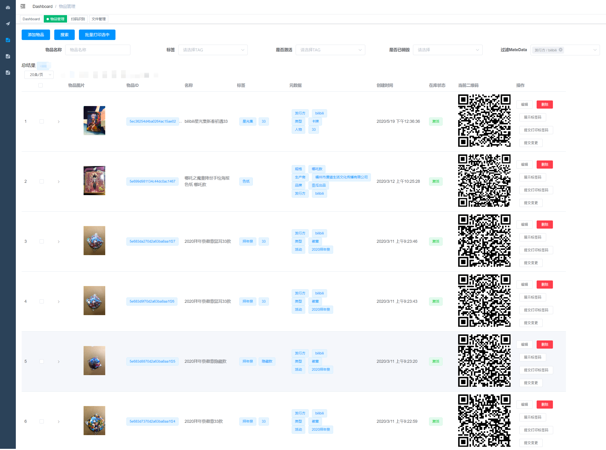
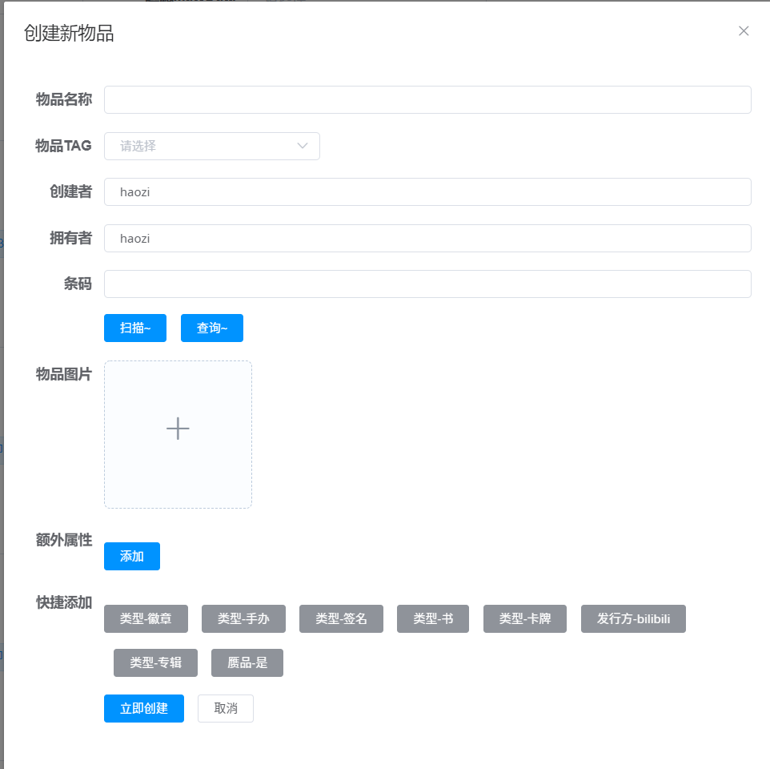
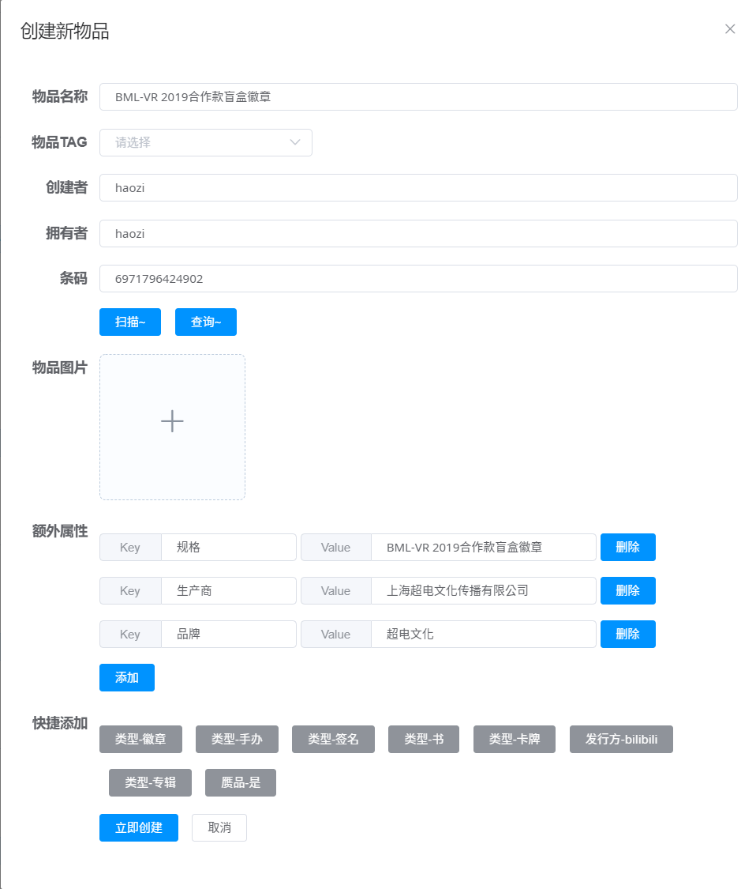
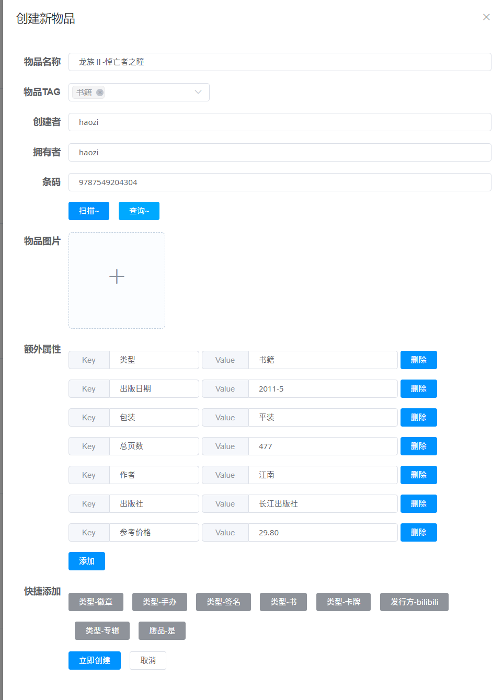
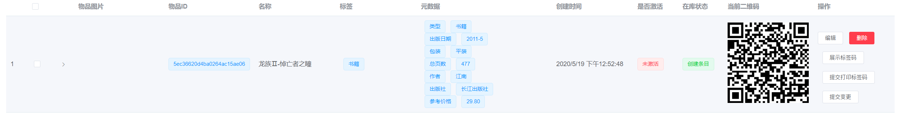
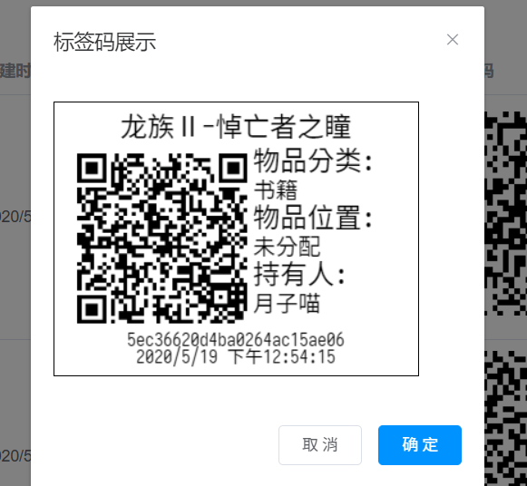
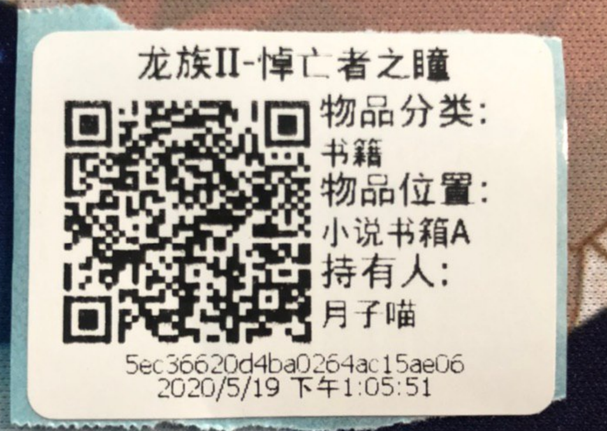
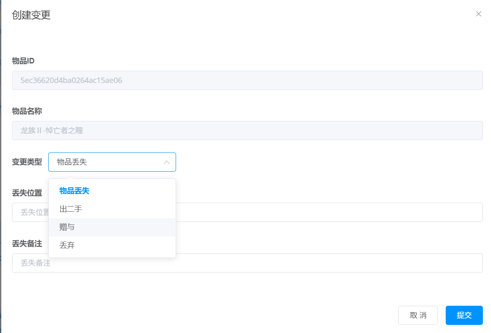
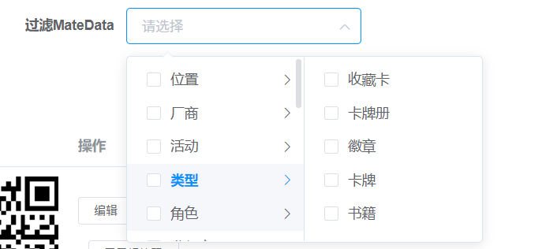

# 月子喵的WMS

源于过年后没事干的一个灵感, (因为一直在收集一些, 徽章, 挂件, 卡牌啥的), 需要经常的出售和购买交换一些物品. 做了这么一个东西, 用来快速查找这些收藏品的存量, 和存放位置, 后面扩展到把几箱子书进行了分类存放.  

 

虽然功能不是很多, 但是前前后后花了也有几十个小时(学习打印机协议, 调试打印机, 找比较好的数据接口, 前后端代码)

目前的话, 暂时还不打算开源 (~~要重写前端, 抛弃 Element UI~~), ~~也有想法做成公共服务, 按量付费, 量少免费~~

<!--truncate-->

## 列表截图

## 创建物品并添加基础信息

可以自己填写相关数据, 如果懒得填而且这个物品有条码, 就可以填写条码然后点击 `查询` , 例如 `6971796424902` (手机端可以点击扫描, 调用摄像头扫描条码)

就会按照 提供的数据进行自动填充, 如果是书也是可以的. 例子 `9787549204304`

> 做书这个功能的时候, 是因为我大概一年就会换一个地方住, 也没个正儿八经的书柜, 所以我的书都是放在箱子里面的, 有时候翻起来让人头疼

就可以看到这一个物品了

这时候就可以选择继续添加物品, 或者补全数据了

## 生成标签

点击右边的显示标签码就可以预览要被贴上去的标签了

为了防止误操作, 或者重复录入, 默认物品状态为 `未激活`, 需要打印出这个标签码, 然后手机端扫码点击确认. 

把物品位置, 分类啥的, 补全完成后, 点击 `打印标签码` 内网的打印机就可以输出一张

> 二维码内没有图片信息, 所以任何时间补充都可以的

## 激活数据

找地方贴好之后, 到手机上进入扫描模式 (下方是视频)

<video src="./IMG_0932.MP4" controls="controls" preload="preload"></video>

回到物品列表, 这里面已经显示了封面图片, 以及操作日志

## 物品变更

物品信息右边, 点击 `提交变更`

四大类, `丢失`, `出二手`, `赠与`, `丢弃`,  提交之后也会同步日志

## 搜索

按照前面创建物品里面的 `MateData`, 可以快速的搜索到你想要的数据集合

当然也支持通过 `物品名称` 进行全文搜索

## 扩展

目前还有一个大功能点没做完, `Box`,  比如一些小物件, 是一个集合的(贴纸, 徽章, CD, 歌词本, U盘, 手幅, 立牌, 钥匙扣啥的), 可以添加到一个 Box 里面, 这样看起来比较爽, 对比缺失物品的时候也比较方便

`MateData` 后面也可以扩展一些特殊字段, 比如过期日, 维护日 之类的系统可以定时通知

如果以后 NFC 标签可以更便宜一些, 可以考虑使用 NFC标签贴片

## 后

这个玩意目前还在慢慢的开发, 如果有啥建议, 欢迎留言~

## 数据来源

[1]: https://3023data.com 条码数据来自

[2]: http://juhe.cn ISBN数据来自

