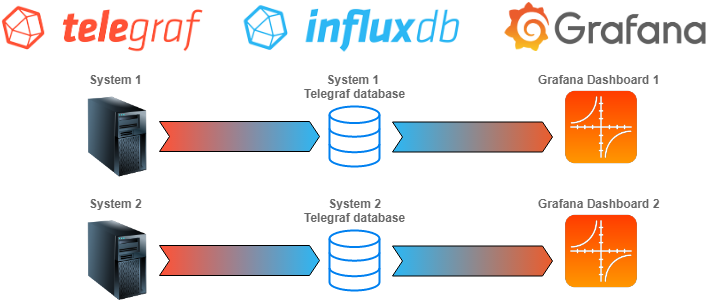
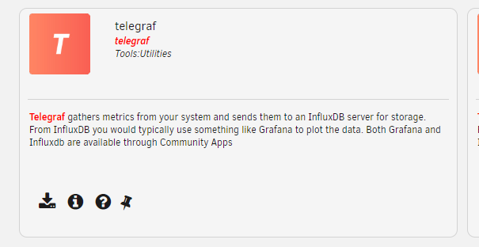
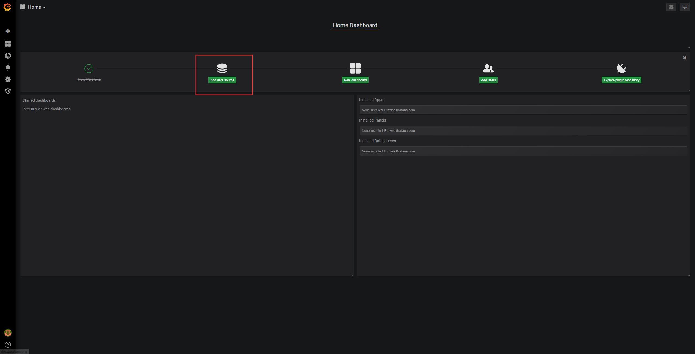
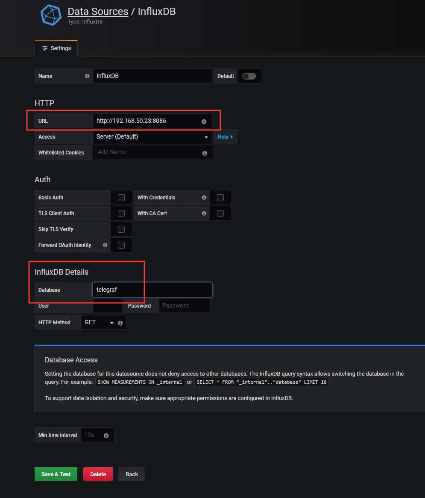
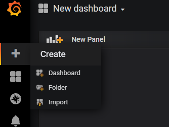
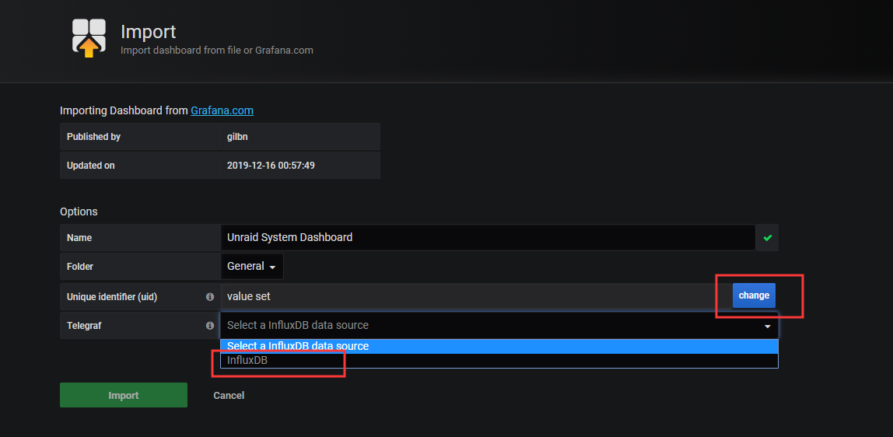
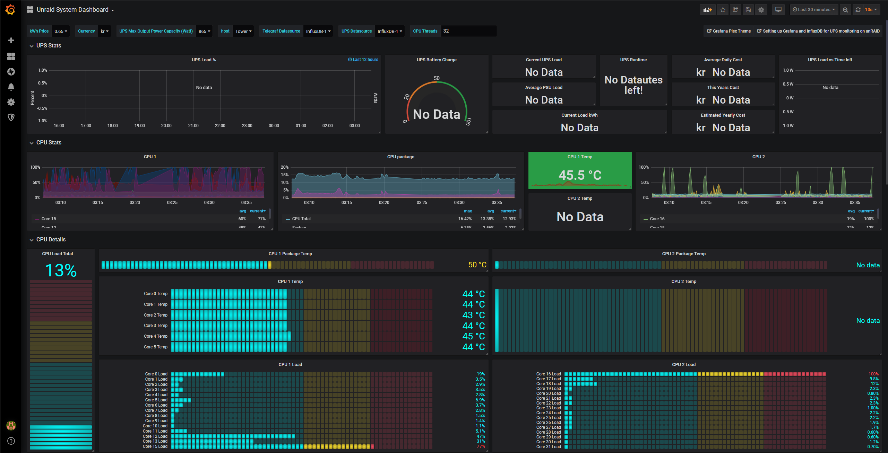

# 给Unraid添加可视化监控

最近看到很多人都是因为 unraid 访问到我的博客, 这里也更新一些小技巧
本篇是如何给 Unraid 增加一个可视化的监控

<!--truncate-->

可以统计

*  UPS  信息
* CPU 信息 （温度， 使用率）
* 磁盘 信息 （读写速度， 容量）
* Dcoker 信息

## 原理

Telegraf 采集 Unraid 上的硬件信息, 并存储在 InfluxDB 内, 并使用 Grafana 进行展示

这里使用了@MariusGilberg 的图 

点击这些阅读更多内容 **[Telegraf](https://www.influxdata.com/time-series-platform/telegraf/), [InfluxDB](https://www.influxdata.com/time-series-platform/), [Grafana](https://grafana.com/docs/v4.3/)**

## 安装基础软件

### 安装Community Apps

这个前面推荐过, [官方文档](https://forums.unraid.net/topic/38582-plug-in-community-applications/)

安装方式:

Unraid 主页 ->  插件(Plugins) -> 安装插件(Install Plugin) 下面输入即可

`
https://forums.unraid.net/topic/38582-plug-in-community-applications/
`

### 安装 influxdb 

[官方安装教程](https://docs.influxdata.com/influxdb/v1.7/introduction/installation/)

或者使用 UNRAID 的 Community Apps 来安装, 我因为使用的DB比较多 专门有一个虚拟机处理所有的 DB

### 安装 Telegraf

这个就必须在 Community Apps  中下载了, 不过先建立配置文件

> 必须先存在配置文件, Telegraf 容器才会启动

默认的配置文件下载地址 https://github.com/influxdata/telegraf/blob/master/etc/telegraf.conf

> 这个文件最好放置在 `/mnt` 路径下, 防止系统重启被清除, 比如可以放置在 `/mnt/cache/appdata/telegraf/telegraf.conf`

修改里面的输出配置, 搜索 ` OUTPUT PLUGINS `, 在这下面就是数据库配置了, 如果你没有修改过 `influxdb`那么就只需要修改 `urls = ["http://127.0.0.1:8086"]` 这句即可, 将前面的 `#`删除, IP地址替换为您的 `influxdb `地址

#### 配置 Telegraf

需要设置一些数据源, 在配置文件中修改下面的,  (如果没有特殊配置就只需要取消前面的注释即可)

* 硬盘温度: `[[inputs.hddtemp]]`
* CPU 温度: `[[inputs.sensors]]`
* 网卡: `[[inputs.net]]` 和 `interfaces = ["eth0"]`
  * 这个要看你的网卡叫啥名字, 可以ssh上去 `ip addr`
* 网络状态: `[[inputs.netstat]]`
* Docker:  `[[inputs.docker]]` 和  `endpoint = "unix:///var/run/docker.sock"`

在 Community Apps 中搜索 `Telegraf`, 点击下面的下载

修改里面的 `Host Path 7`为你的配置地址, 如果你用的也是 `/mnt/user/appdata/telegraf/telegraf.conf`则不用

最后点击 apply 即可, 等待 docker 部署, 提示成功后在 Docker 中可以看到, 运行成功

### 安装 Grafana

[官方安装教程](https://grafana.com/docs/grafana/latest/installation/)

可以使用 Community Apps 安装 也可以单独安装, 我这边是在 K8s 内安装的

## 配置 Grafana 参数

### 添加数据源

在控制台首页点击添加 数据源 

选择 InfluxDB

配置里面的参数为 influxdb  安装的参数 , 红框参数即可

* URL :  influxdb   地址, 端口是 HTTP 协议的端口
* Database:  数据库名称(默认为 **telegraf**)

测试并保存

### 导入 控制台

左上角点击加号 内的 **Import**

输入 `7233`, 跳转到 Import 界面

首先点击 Change , 修改唯一ID,  然后选择数据源为刚刚添加的

导入成功~

这里面数据非常的多,  由于我没用 UPS 所以 数据为空

### 修改控制台

* 把不需要的数据列删除
  *  UPS 信息
  * CPU2 的数据
  * 硬盘温度 (阵列卡就没数据)
* 把展示区域大小不合适修改一下

>  如果你添加了 或者删除了硬盘必须编辑 驱动器列表 参考 [这篇文章的 Some assembly needed](https://technicalramblings.com/blog/how-to-setup-grafana-influxdb-and-telegraf-to-monitor-your-unraid-system/)

## 后

最后展示一下我整理后的界面

如果想看到更多的关于 UNRAID  的文章， 点击 [UNRAID 分类把](/tags/#unraid)

## 参考资料

[1]:  How to setup Grafana, InfluxDB and Telegraf to monitor your unRAID system: https://technicalramblings.com/blog/how-to-setup-grafana-influxdb-and-telegraf-to-monitor-your-unraid-system/

[2]:   [Plug-In] Community Applications:  https://forums.unraid.net/topic/38582-plug-in-community-applications/

[3]: Installing InfluxDB OSS: https://docs.influxdata.com/influxdb/v1.7/introduction/installation/

[4]: Installing Grafana: https://grafana.com/docs/grafana/latest/installation/

