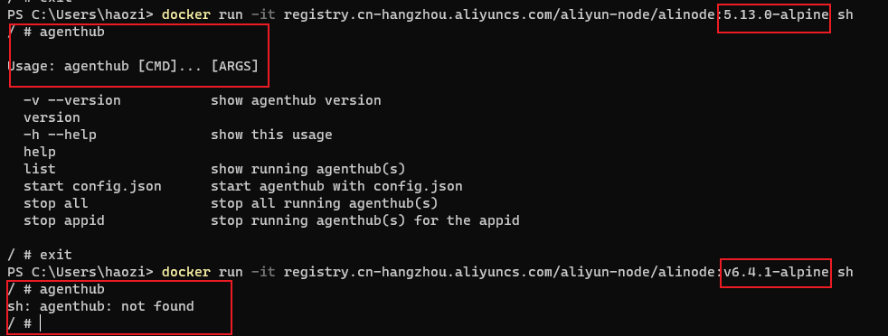
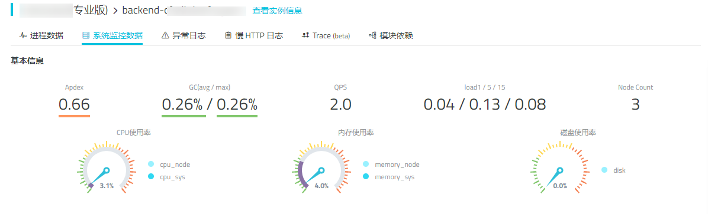
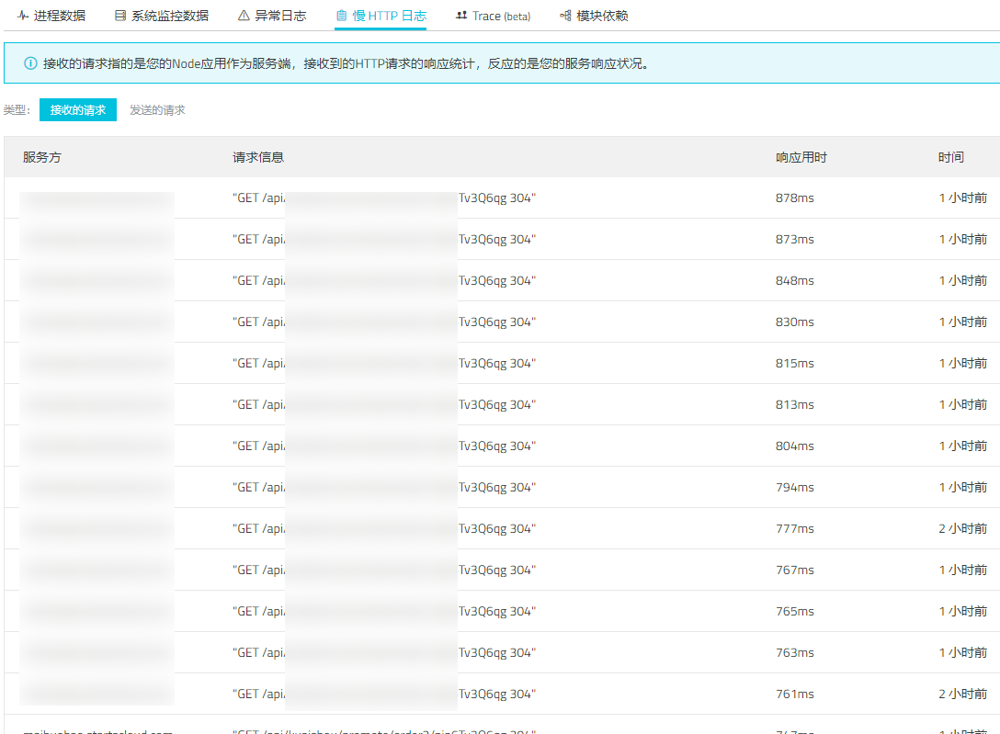
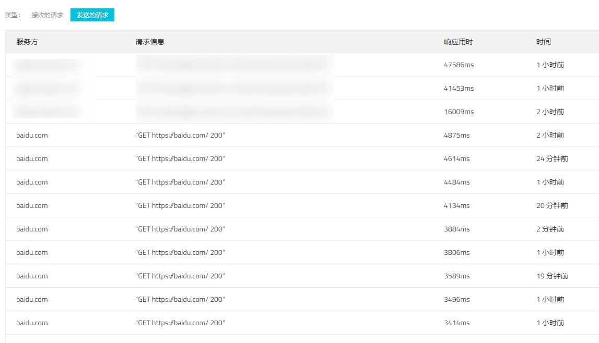

虽然项目没出啥问题,  但是未雨绸缪想对里面的一些功能点的性能做一些跟踪, 打算试试[ `alinode`](https://node.console.aliyun.com/)的 Trace 功能,

之前高负载的时候需要扩容到3个,  通过 redis 来共享异步任务,  才能处理完,  觉得里面某些组件确实有点慢的离谱了, 懒得打日志了, 直接挂个 Trace


<!--truncate-->

## 安装 alinode

我们项目用的是k8s,  所以按照文档直接在 `Dockerfile` 里把 node 换成 alinode 即可

```dockerfile
# 将
FROM node:15.3.0-alpine3.10
# 替换为最新版本的
FROM registry.cn-hangzhou.aliyuncs.com/aliyun-node/alinode:v6.4.1-alpine
```

然后在k8s的编排文件中, 填写好环境变量 `APP_ID`, `APP_SECRET`

```yaml
- name: APP_ID
  value: '*****'
- name: APP_SECRET
  value: 4f****************************869c1
```

直接滚动更新, 不出意外1分钟内, 就可以在性能平台看到实例了, 


## 排错

?????? 等了五六分钟, 奇了怪了还是0, 就他妈离谱, 先后试了几种办法

* 反复阅读文档

* 先检查环境变量是否错误
* 换了一种传参方式 ->  `app-config.json`
* 进容器看看node版本号

最后发现了一个非常离谱的事情



他妈的的 `6.4.1` 的镜像里面根本没有 `agenthub`, 那就先拿 `5.13.0-alpine` 用着


## 控制台




半夜的负载是真的低, 不过QPS竟然有2, 大概是运营没关后台, 有自动刷新请求在执行



好家伙,  虽然想到了这个查询耗时特别长, 没想到这么慢, 去看了一下到底查了啥, 

绝了, 一般来说这个请求也就五六个聚合查询,  运营一顿操作, 直接来了二十多个,  延迟直接上去了, 后面要对这些子查询做缓存了




啊这. 我这么没面子的吗.  设置的 timeout 怎么没生效, 设置的 5秒, 怎么都到 47秒了 (请求百度是为了测试代理的活跃, 用来排除异常代理的)

## 后~

还没开始做 Trace 就发现俩可以优化的了,  非常有排面, 先修了再说
