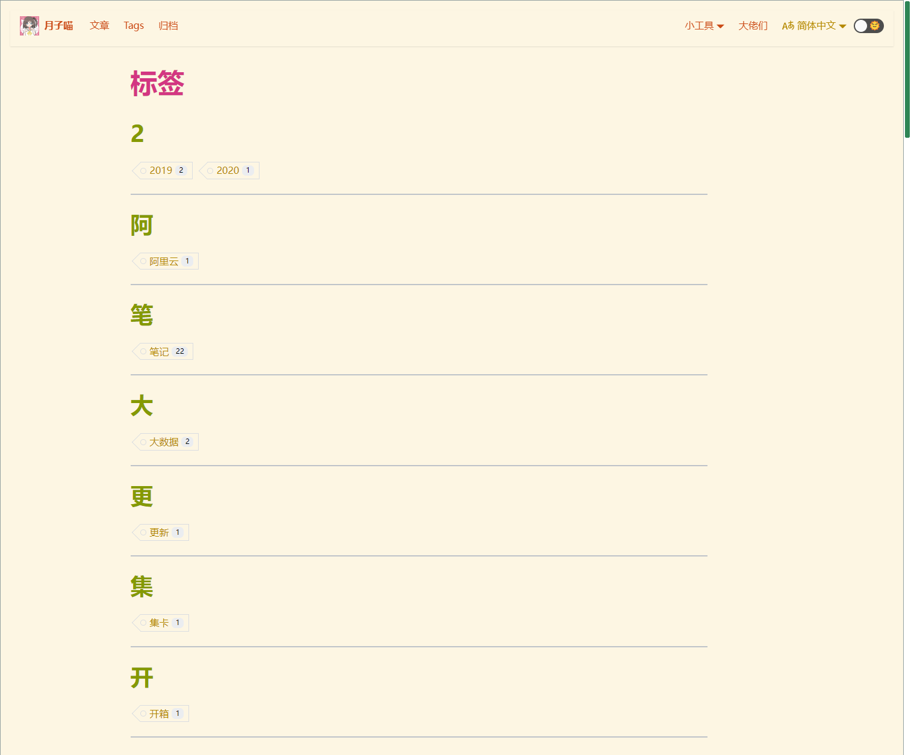
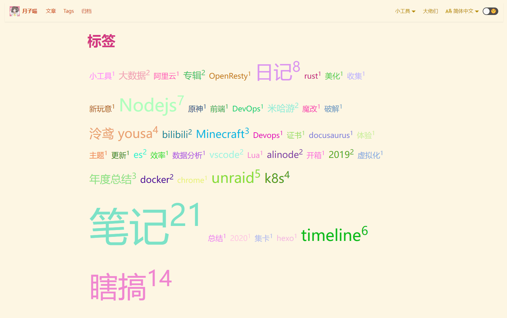

有一说一这个看到就有点无语



直接上手魔改

<!--truncate-->

## 效果



## 复制这个Tag组件

```sh
npm run swizzle @docusaurus/theme-classic TagsListByLetter  -- --danger
```

可以看到 `src/theme` 里面出现了一个新的组件 `TagsListByLetter`

```javascript
/**
 * Copyright (c) Facebook, Inc. and its affiliates.
 *
 * This source code is licensed under the MIT license found in the
 * LICENSE file in the root directory of this source tree.
 */
import React from 'react';
import Tag from '@theme/Tag';
import {listTagsByLetters} from '@docusaurus/theme-common';
import styles from './styles.module.css';

function TagLetterEntryItem({letterEntry}) {
  return (
    <article>
      <h2>{letterEntry.letter}</h2>
      <ul className="padding--none">
        {letterEntry.tags.map((tag) => (
          <li key={tag.permalink} className={styles.tag}>
            <Tag {...tag} />
          </li>
        ))}
      </ul>
      <hr />
    </article>
  );
}

function TagsListByLetter({tags}) {
  const letterList = listTagsByLetters(tags);
  console.log(tags)
  return (
    <section className="margin-vert--lg">
      {letterList.map((letterEntry) => (
        <TagLetterEntryItem
          key={letterEntry.letter}
          letterEntry={letterEntry}
        />
      ))}
    </section>
  );
}

export default TagsListByLetter;
```

源码非常简单, 调用 `listTagsByLetters` 函数获取所有的标签, 并且按照第一个字分组, 在英语环境下也就26个首字母, 这么排完全没问题 但是遇到序号前缀比如年份, 中文文字, 这里就会出现问题

## 修改 Tag 显示模式为 Tag CLoud

其实这里考虑修改分词模式, 引入中文分词, 但是这里修改为更适合中文显示的 Tag cloud 模式

安装 React 组件 ` npm i --save react-tagcloud` , 如果提示版本不兼容, 可以使用 `--legacy-peer-deps` 参数

<RepoCards user="madox2"repos={["react-tagcloud"]}/>

详细参数的话点上门的 repo

```javascript
/**
 * Copyright (c) Facebook, Inc. and its affiliates.
 *
 * This source code is licensed under the MIT license found in the
 * LICENSE file in the root directory of this source tree.
 */
import React from 'react';
import {TagCloud} from 'react-tagcloud'
import './Tags.css'
import {Badge} from "antd";
import Link from "@docusaurus/core/lib/client/exports/Link";

function TagsListByLetter({tags}) {
    const data = tags.map(v => {
        return {
            value: v.name,
            count: v.count,
            to: v.slug
        }
    })
    return (
        <TagCloud
            className="tag-cloud"
            minSize={24}
            maxSize={128}
            options={{
                hue: 'blue',
            }}
            tags={data}
            renderer={(tag, size, color) => {
                return (
                   <>
                       <Link to={tag.to}>
                            <span
                                key={tag.value}
                                style={{
                                    animation: 'blinker 3s linear infinite',
                                    animationDelay: `${Math.random() * 2}s`,
                                    fontSize: size,
                                    margin: '3px',
                                    padding: '3px',
                                    display: 'inline-block',
                                    color: color,
                                }}
                            >
                        <Badge count={tag.count}>
                    {tag.value}
                    </Badge>
                </span>
                       </Link>
                   </>
                )
            }}
        />
    );
}

export default TagsListByLetter;
```
