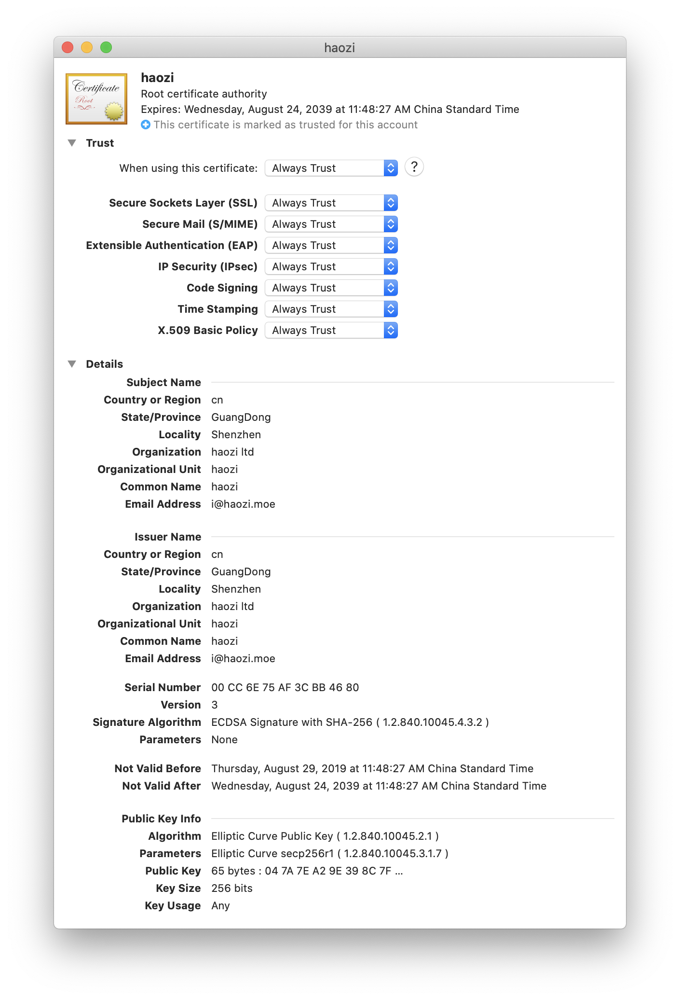
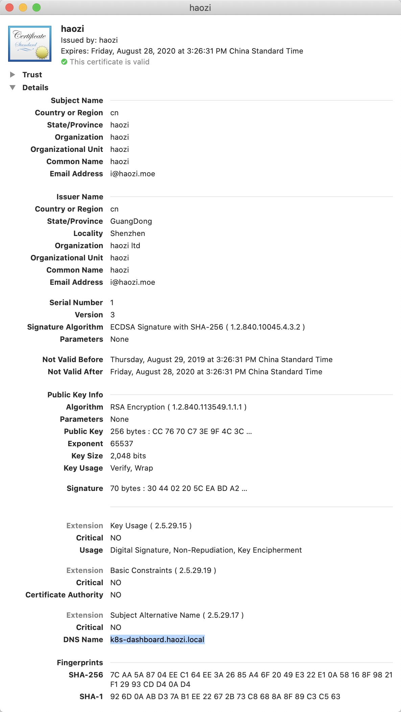
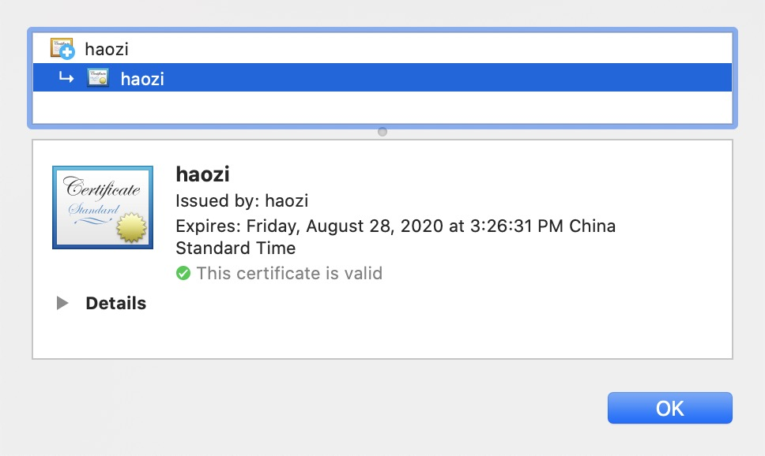

# 自建CA并签发证书

为了家里内网服务部署的方便使用了统一的域名 `haozi.local` , 这是一个本地域名, 没法通过常规的方式申请有效的https证书, 所以需要在内网搭建一个专门的CA,用于签发这个域名的证书等, 后面我们将搭建一个 `letsencrypt`的服务端, 自动签发


<!--truncate-->

## 自建CA颁发机构

查看 `/etc/pki/tls/openssl.cnf` 配置文件,  一般用的话不需要修改, 这里为了内网使用方便修改了 `default_days` (证书的有效时间, 默认365天)参数.还有home 等文件位置

### 生成CA证书

使用 RSA 算法生成 2048 位 CA 私钥

```sh
openssl genrsa -out ~/ca/ca.key.pem 2048
```

生成CA证书请求文件, 按照提示填写正确的信息

```sh
openssl req -new -key ~/ca/ca.key.pem -new -x509 -days 3650 -sha256 -extensions v3_ca -out ~/ca/ca.cert.pem
```

`ca.cert.pem` 这个文件就可以发给各个客户端进行安装, 用于信任之后签发的所有证书


这里是在 mac 上, (在 Trust Tab 里面, 将信任设置为一直信任)




## 给 k8s-dashboard-haozi.local 签发证书
### 生成服务器私钥
```sh
openssl genrsa -out ~/ca/k8s-dashboard.haozi.local/key.pem 2048
```
### 生成自签名证书 
```sh
openssl req -new -key ~/ca/k8s-dashboard.haozi.local/key.pem -out ~/ca/k8s-dashboard.haozi.local/userreq.pem
```

### 使用 CA 签名证书

复制一份 `openssl.conf` 到自己的文件夹, 修改一下的配置

这部分是 CA 证书的配置

```toml
[ CA_default ]

dir		= /Users/haozi/ca		# Where everything is kept  
certs		= $dir/certs		# Where the issued certs are kept
crl_dir		= $dir/crl		# Where the issued crl are kept
database	= $dir/index.txt	# database index file.
#unique_subject	= no			# Set to 'no' to allow creation of
					# several ctificates with same subject.
new_certs_dir	= $dir/newcerts		# default place for new certs.

certificate	= $dir/ca.cert.pem 	# The CA certificate ca证书的地址
serial		= $dir/serial 		# The current serial number 生成的序号
crlnumber	= $dir/crlnumber	# the current crl number		
					# must be commented out to leave a V1 CRL
crl		= $dir/crl.pem 		# The current CRL
private_key	= $dir/ca.key.pem  # The private key ca证书私钥的地址
RANDFILE	= $dir/private/.rand	# private random number file
```

这部分是要签名的证书的配置

```toml
[ req ]
prompt             = no
distinguished_name = server_distinguished_name
req_extensions     = req_ext
x509_extensions	= v3_req
attributes		= req_attributes
 
[ server_distinguished_name ]
commonName              = haozi.local
stateOrProvinceName     = Shenzhen
countryName             = CN
organizationName        = haozi Inc
organizationalUnitName  = haozi
 
[ v3_req ]
basicConstraints        = CA:FALSE
keyUsage = nonRepudiation, digitalSignature, keyEncipherment
subjectAltName      = @alternate_names

[ alternate_names ]
DNS.1        = k8s-dashboard.haozi.local  #这里是要签发域名
```

按照上面的配置创建以下文件和文件夹

```sh
mkdir newcerts
touch index.txt
touch index.txt.attr
echo 01 > serial
```


`-config`处填写为自己上面的 openssl.conf 的位置

```sh
openssl ca -config openssl.cnf -extensions v3_req -in userreq.pem -out usercert.pem
```

```sh
~/ca/k8s-dashboard.haozi.local at ☸️  kubernetes-admin@kubernetes took 45s
➜ openssl ca -config openssl.cnf -extensions v3_req -in userreq.pem -out usercert.pem
Using configuration from openssl.cnf
Check that the request matches the signature
Signature ok
Certificate Details:
        Serial Number: 1 (0x1)
        Validity
            Not Before: Aug 29 07:26:31 2019 GMT
            Not After : Aug 28 07:26:31 2020 GMT
        Subject:
            countryName               = cn
            stateOrProvinceName       = haozi
            organizationName          = haozi
            organizationalUnitName    = haozi
            commonName                = haozi
            emailAddress              = i@haozi.moe
        X509v3 extensions:
            X509v3 Basic Constraints:
                CA:FALSE
            X509v3 Key Usage:
                Digital Signature, Non Repudiation, Key Encipherment
            X509v3 Subject Alternative Name:
##
# Host Database
                DNS:k8s-dashboard.haozi.local
Certificate is to be certified until Aug 28 07:26:31 2020 GMT (365 days)
Sign the certificate? [y/n]:Y  # 直接 Y 确认就好了


1 out of 1 certificate requests certified, commit? [y/n]Y
Write out database with 1 new entries
##
Data Base Updated

```

> 如果出现了 `The stateOrProvinceName field needed to be the same in the` 这个问题 参考 [The stateOrProvinceName field needed to be same](http://doc.okbase.net/fajar/archive/240528.html)



## 测试

nginx 写上测试站点, 查看一下效果

```
   server {
        listen 443 ssl;
        server_name k8s-dashboard.haozi.local;

        ssl_certificate /Users/haozi/ca/k8s-dashboard.haozi.local/usercert.pem;

        ssl_certificate_key /Users/haozi/ca/k8s-dashboard.haozi.local/key.pem;

        location / {
            proxy_pass http://127.0.0.1:4000;
        }
    }
```



正常如此
