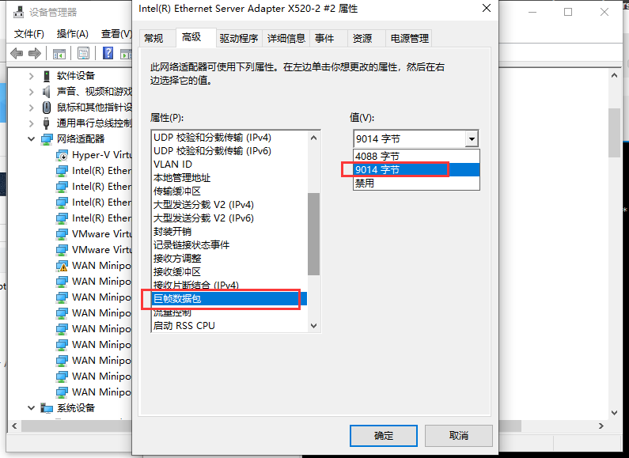
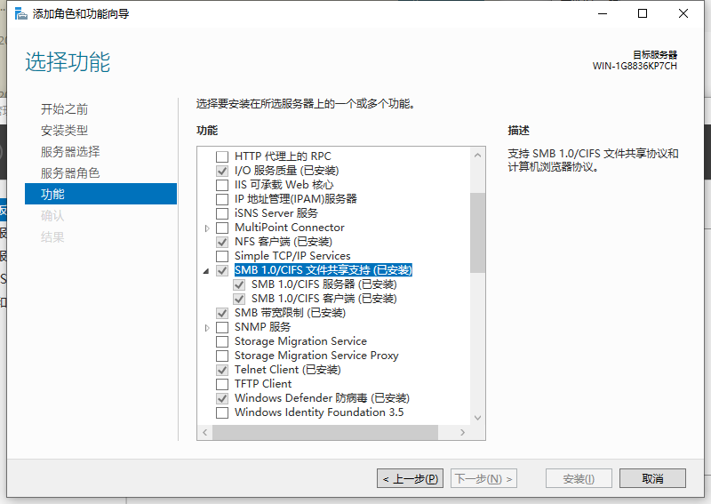

# 解决 Windows Server SMB 跑不满速度

最近给我的服务器增加了一块 `Intel P3605`, 把 Unraid 上面的所有虚拟机都迁移过去. 单独开了一个 Share 测试速度, 我的 PC 和服务器是用 10G 的光纤直连的, 但是测试发现根本跑不满速度, 大概只有 4 - 5 Gbps.


虽然咱用不着 1G/s 这么大的速度, 但是作为垃圾佬为什么不榨干他的性能呢


<!--truncate-->


## 解决

### 硬盘

这固态虽然 8 可能性能瓶颈, 本着测试的严谨还是测试了一下

```sh
root@Tower:~# sh diskspeed.sh 

diskspeed.sh for UNRAID, version 2.6.5
By John Bartlett. Support board @ limetech: http://goo.gl/ysJeYV

Warning: Files in the array are open. Please refer to /tmp/lsof.txt for a list
/dev/nvme0n1 (Disk 2): 3127 MB/sec avg
/dev/sdc (Disk 1): 738 MB/sec avg
/dev/sdd: 1418 MB/sec avg
/dev/sde (Cache): 1445 MB/sec avg

To see a graph of the drive's speeds, please browse to the current
directory and open the file diskspeed.html in your Internet Browser
application.

```

`/dev/nvme0n1` 就是我的 P3605, 3G/s 完全不是瓶颈

### 网卡

然后怀疑是网卡的问题, 先用 [Iperf](https://iperf.fr/) 测速, 先给 Unraid 服务器装上 (官网下载, 选择最下面的 [**Linux manual Installation 64 bits**](https://iperf.fr/iperf-download.php#manual) (AMD64)

**Manual installation of iperf3 3.1.3 64 bits :**

1. sudo wget -O /lib64/libiperf.so.0 https://iperf.fr/download/ubuntu/libiperf.so.0_3.1.3
2. sudo wget -O /usr/bin/iperf3 https://iperf.fr/download/ubuntu/iperf3_3.1.3 
3. sudo chmod +x /usr/bin/iperf3

**这里修改了 so 库存放的位置**

用 `iperf3 -s` 启动服务器, 客户端 `iperf3 -c <服务器IP>`

```powershell
PS C:\Users\Administrator\Desktop\temp\iperf-3.1.3-win64> .\iperf3.exe -c 192.168.233.1
Connecting to host 192.168.233.1, port 5201
[  4] local 192.168.233.2 port 61104 connected to 192.168.233.1 port 5201
[ ID] Interval           Transfer     Bandwidth
[  4]   0.00-1.00   sec   493 MBytes  4.13 Gbits/sec
[  4]   1.00-2.00   sec   474 MBytes  3.97 Gbits/sec
[  4]   2.00-3.00   sec   514 MBytes  4.31 Gbits/sec
[  4]   3.00-4.00   sec   445 MBytes  3.73 Gbits/sec
[  4]   4.00-5.00   sec   515 MBytes  4.32 Gbits/sec
[  4]   5.00-6.00   sec   514 MBytes  4.31 Gbits/sec
[  4]   6.00-7.00   sec   516 MBytes  4.33 Gbits/sec
[  4]   7.00-8.00   sec   490 MBytes  4.11 Gbits/sec
[  4]   8.00-9.00   sec   500 MBytes  4.19 Gbits/sec
[  4]   9.00-10.00  sec   442 MBytes  3.71 Gbits/sec
- - - - - - - - - - - - - - - - - - - - - - - - -
[ ID] Interval           Transfer     Bandwidth
[  4]   0.00-10.00  sec  4.79 GBytes  4.11 Gbits/sec                  sender
[  4]   0.00-10.00  sec  4.79 GBytes  4.11 Gbits/sec                  receiver

iperf Done.
```


### 巨型帧

emm 看起来的确是, 查了查说是网卡的巨型帧没开启, 进入设备管理器, 选择你的网卡 -> 高级 -> 巨帧数据包, 将禁用改成 `9014字节`



```powershell
PS C:\Users\Administrator\Desktop\temp\iperf-3.1.3-win64> .\iperf3.exe -c 192.168.233.1
Connecting to host 192.168.233.1, port 5201
[  4] local 192.168.233.2 port 60618 connected to 192.168.233.1 port 5201
[ ID] Interval           Transfer     Bandwidth
[  4]   0.00-1.00   sec   504 MBytes  4.22 Gbits/sec
[  4]   1.00-2.00   sec   507 MBytes  4.26 Gbits/sec
[  4]   2.00-3.00   sec   514 MBytes  4.31 Gbits/sec
[  4]   3.00-4.00   sec   506 MBytes  4.24 Gbits/sec
[  4]   4.00-5.00   sec   520 MBytes  4.36 Gbits/sec
[  4]   5.00-6.00   sec   518 MBytes  4.34 Gbits/sec
[  4]   6.00-7.00   sec   503 MBytes  4.22 Gbits/sec
[  4]   7.00-8.00   sec   516 MBytes  4.33 Gbits/sec
[  4]   8.00-9.00   sec   500 MBytes  4.19 Gbits/sec
[  4]   9.00-10.00  sec   516 MBytes  4.33 Gbits/sec
- - - - - - - - - - - - - - - - - - - - - - - - -
[ ID] Interval           Transfer     Bandwidth
[  4]   0.00-10.00  sec  4.98 GBytes  4.28 Gbits/sec                  sender
[  4]   0.00-10.00  sec  4.98 GBytes  4.28 Gbits/sec                  receiver

iperf Done.
```

似乎高了一点, 但是看起来是误差的样子, 和巨型帧应该没关系


### 并行

最后我试了一下给 iperf3 加了一个 `-P <并行客户端数量>` 设置为 3

```powershell
PS C:\Users\Administrator\Desktop\temp\iperf-3.1.3-win64> .\iperf3.exe -c 192.168.233.1 -d -P 3
send_parameters:
{
        "tcp":  true,
        "omit": 0,
        "time": 10,
        "parallel":     3,
        "len":  131072,
        "client_version":       "3.1.3"
}
Connecting to host 192.168.233.1, port 5201
SO_SNDBUF is 212992
[  4] local 192.168.233.2 port 62963 connected to 192.168.233.1 port 5201
SO_SNDBUF is 212992
[  6] local 192.168.233.2 port 62964 connected to 192.168.233.1 port 5201
SO_SNDBUF is 212992
[  8] local 192.168.233.2 port 62965 connected to 192.168.233.1 port 5201
[ ID] Interval           Transfer     Bandwidth
[  4]   0.00-1.00   sec   372 MBytes  3.12 Gbits/sec
[  6]   0.00-1.00   sec   380 MBytes  3.19 Gbits/sec
[  8]   0.00-1.00   sec   373 MBytes  3.13 Gbits/sec
[SUM]   0.00-1.00   sec  1.10 GBytes  9.44 Gbits/sec
- - - - - - - - - - - - - - - - - - - - - - - - -
[  4]   1.00-2.00   sec   380 MBytes  3.19 Gbits/sec
[  6]   1.00-2.00   sec   387 MBytes  3.25 Gbits/sec
[  8]   1.00-2.00   sec   377 MBytes  3.16 Gbits/sec
[SUM]   1.00-2.00   sec  1.12 GBytes  9.60 Gbits/sec
- - - - - - - - - - - - - - - - - - - - - - - - -
[  4]   2.00-3.00   sec   381 MBytes  3.20 Gbits/sec
[  6]   2.00-3.00   sec   383 MBytes  3.22 Gbits/sec
[  8]   2.00-3.00   sec   377 MBytes  3.16 Gbits/sec
[SUM]   2.00-3.00   sec  1.11 GBytes  9.58 Gbits/sec
- - - - - - - - - - - - - - - - - - - - - - - - -
[  4]   3.00-4.00   sec   380 MBytes  3.19 Gbits/sec
[  6]   3.00-4.00   sec   388 MBytes  3.26 Gbits/sec
[  8]   3.00-4.00   sec   383 MBytes  3.21 Gbits/sec
[SUM]   3.00-4.00   sec  1.12 GBytes  9.66 Gbits/sec
- - - - - - - - - - - - - - - - - - - - - - - - -
[  4]   4.00-5.00   sec   376 MBytes  3.16 Gbits/sec
[  6]   4.00-5.00   sec   390 MBytes  3.27 Gbits/sec
[  8]   4.00-5.00   sec   358 MBytes  3.00 Gbits/sec
[SUM]   4.00-5.00   sec  1.10 GBytes  9.43 Gbits/sec
- - - - - - - - - - - - - - - - - - - - - - - - -
[  4]   5.00-6.00   sec   381 MBytes  3.20 Gbits/sec
[  6]   5.00-6.00   sec   391 MBytes  3.28 Gbits/sec
[  8]   5.00-6.00   sec   377 MBytes  3.16 Gbits/sec
[SUM]   5.00-6.00   sec  1.12 GBytes  9.64 Gbits/sec
- - - - - - - - - - - - - - - - - - - - - - - - -
[  4]   6.00-7.00   sec   388 MBytes  3.26 Gbits/sec
[  6]   6.00-7.00   sec   385 MBytes  3.23 Gbits/sec
[  8]   6.00-7.00   sec   380 MBytes  3.19 Gbits/sec
[SUM]   6.00-7.00   sec  1.13 GBytes  9.68 Gbits/sec
- - - - - - - - - - - - - - - - - - - - - - - - -
[  4]   7.00-8.00   sec   384 MBytes  3.22 Gbits/sec
[  6]   7.00-8.00   sec   389 MBytes  3.26 Gbits/sec
[  8]   7.00-8.00   sec   376 MBytes  3.15 Gbits/sec
[SUM]   7.00-8.00   sec  1.12 GBytes  9.64 Gbits/sec
- - - - - - - - - - - - - - - - - - - - - - - - -
[  4]   8.00-9.00   sec   388 MBytes  3.26 Gbits/sec
[  6]   8.00-9.00   sec   385 MBytes  3.23 Gbits/sec
[  8]   8.00-9.00   sec   375 MBytes  3.15 Gbits/sec
[SUM]   8.00-9.00   sec  1.12 GBytes  9.64 Gbits/sec
send_results
{
        "cpu_util_total":       60.341746,
        "cpu_util_user":        12.751200,
        "cpu_util_system":      47.590546,
        "sender_has_retransmits":       0,
        "streams":      [{
                        "id":   1,
                        "bytes":        3984850944,
                        "retransmits":  -1,
                        "jitter":       0,
                        "errors":       0,
                        "packets":      0
                }, {
                        "id":   3,
                        "bytes":        4052221952,
                        "retransmits":  -1,
                        "jitter":       0,
                        "errors":       0,
                        "packets":      0
                }, {
                        "id":   4,
                        "bytes":        3929800704,
                        "retransmits":  -1,
                        "jitter":       0,
                        "errors":       0,
                        "packets":      0
                }]
}
get_results
{
        "cpu_util_total":       25.525559,
        "cpu_util_user":        2.740879,
        "cpu_util_system":      22.784797,
        "sender_has_retransmits":       -1,
        "streams":      [{
                        "id":   1,
                        "bytes":        3984836352,
                        "retransmits":  -1,
                        "jitter":       0,
                        "errors":       0,
                        "packets":      0
                }, {
                        "id":   3,
                        "bytes":        4052108800,
                        "retransmits":  -1,
                        "jitter":       0,
                        "errors":       0,
                        "packets":      0
                }, {
                        "id":   4,
                        "bytes":        3929800704,
                        "retransmits":  -1,
                        "jitter":       0,
                        "errors":       0,
                        "packets":      0
                }]
}
- - - - - - - - - - - - - - - - - - - - - - - - -
[  4]   9.00-10.00  sec   369 MBytes  3.09 Gbits/sec
[  6]   9.00-10.00  sec   387 MBytes  3.24 Gbits/sec
[  8]   9.00-10.00  sec   371 MBytes  3.11 Gbits/sec
[SUM]   9.00-10.00  sec  1.10 GBytes  9.45 Gbits/sec
- - - - - - - - - - - - - - - - - - - - - - - - -
[ ID] Interval           Transfer     Bandwidth
[  4]   0.00-10.00  sec  3.71 GBytes  3.19 Gbits/sec                  sender
[  4]   0.00-10.00  sec  3.71 GBytes  3.19 Gbits/sec                  receiver
[  6]   0.00-10.00  sec  3.77 GBytes  3.24 Gbits/sec                  sender
[  6]   0.00-10.00  sec  3.77 GBytes  3.24 Gbits/sec                  receiver
[  8]   0.00-10.00  sec  3.66 GBytes  3.14 Gbits/sec                  sender
[  8]   0.00-10.00  sec  3.66 GBytes  3.14 Gbits/sec                  receiver
[SUM]   0.00-10.00  sec  11.1 GBytes  9.57 Gbits/sec                  sender
[SUM]   0.00-10.00  sec  11.1 GBytes  9.57 Gbits/sec                  receiver

iperf Done.
```


### SMB3.0

好家伙, 差不多跑满了, 这说明应该是不是网卡的问题, 那就是 SMB 本身的问题. 想起来 SMB3.0 有一个特性是 多通道, 先打开看看




NMD, server 1903 不支持

## 最后的解决办法

最后 google 到的, 在 PowerShell里面输入, 


```powershell
Set-SmbServerConfiguration -EnableSMB2Protocol $true
```

开启 SMB3

<!-- -->

舒服惹~

<!--truncate-->

