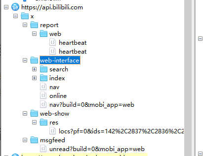

# 记一次APP抓包破解

最近没事干. 随便找了一个APP看看, 学习一下大公司的接口设计, 以及架构


<!--truncate-->


## 思路

* 先抓包大致看一下大部分的接口鉴权和参数
* 锁定鉴权参数, token类型, 查看是否有 sign 算法
* 如果需要校验的 sign 就拆包看代码

## 过程

### 抓包

这里用了 `charles` 和 `fiddler 4`两个抓包工具

> `charles` 的好处就是会按照 path 进行分类 (api.bilibili.com 例子)
>
> 
>
> 有没有人开车一起买 charles 授权的

使用的过程中主要是遇到了证书授权的问题, 解决方案如下

* IOS 证书信任
  * 在 Safari 中安装 证书, 并信任之后
  * General -> About -> Certificate Trusr Settings -> 启用你安装的证书
* Android 证书信任
  * 在浏览器下载证书后安装, 选择 VPN 和 APPS
  * 如果遇到 `java.security.cert.CertPathValidatorException: Trust anchor for certification path not found.` 有两个解决方案
    * 使用 Android 6 版本及以下的系统, 就不会有这个校验
    * Android 7+ 版本参考 [Android7.0以上使用Charles抓包Https](https://juejin.im/post/5c611302f265da2ddc3c5622)

### 反编译

这里选择的是比较方便的 Android 包

使用常规的 **apktool**，**dex2jar**，**jd-gui**

#### 在使用 `apktool` 中遇到的问题

```plain_text
I: Using Apktool 2.4.1 on xxx.apk
I: Loading resource table...
I: Decoding AndroidManifest.xml with resources...
I: Loading resource table from file: C:\Users\Administrator\AppData\Local\apktool\framework\1.apk
I: Regular manifest package...
I: Decoding file-resources...
I: Decoding values */* XMLs...
I: Baksmaling classes.dex...
I: Baksmaling classes2.dex...
I: Baksmaling assets/A3AEECD8.dex...
Exception in thread "main" org.jf.dexlib2.dexbacked.DexBackedDexFile$NotADexFile: Not a valid dex magic value: cf 77 4c c7 9b 21 01 cd
        at org.jf.dexlib2.util.DexUtil.verifyDexHeader(DexUtil.java:93)
        at org.jf.dexlib2.dexbacked.DexBackedDexFile.getVersion(DexBackedDexFile.java:111)
        at org.jf.dexlib2.dexbacked.DexBackedDexFile.<init>(DexBackedDexFile.java:78)
        at org.jf.dexlib2.dexbacked.DexBackedDexFile.<init>(DexBackedDexFile.java:138)
        at org.jf.dexlib2.dexbacked.ZipDexContainer$1.getDexFile(ZipDexContainer.java:181)
        at brut.androlib.src.SmaliDecoder.decode(SmaliDecoder.java:90)
        at brut.androlib.src.SmaliDecoder.decode(SmaliDecoder.java:39)
        at brut.androlib.Androlib.decodeSourcesSmali(Androlib.java:96)
        at brut.androlib.ApkDecoder.decode(ApkDecoder.java:164)
        at brut.apktool.Main.cmdDecode(Main.java:170)
        at brut.apktool.Main.main(Main.java:76)
Press any key to continue . . .                                       
```

解决办法如下

增加 `d --only-main-classe`  即可

```plain_text
PS C:\Users\Administrator\Desktop\work\> ./apktool d --only-main-classe .\xxx.apk                                   I: Using Apktool 2.4.1 on xxx.apk
I: Loading resource table...
I: Decoding AndroidManifest.xml with resources...
I: Loading resource table from file: C:\Users\Administrator\AppData\Local\apktool\framework\1.apk
I: Regular manifest package...
I: Decoding file-resources...
I: Decoding values */* XMLs...
I: Baksmaling classes.dex...
I: Baksmaling classes2.dex...
I: Copying raw assets/A3AEECD8.dex file...
I: Copying assets and libs...
I: Copying unknown files...
I: Copying original files...
Press any key to continue . . .                                             
```


#### 在 dex2jar 遇到的问题

遇到了 **OutOfMemoryError** 这个问题, 解决办法

修改 `d2j_invoke.bat` / `d2j_invoke.sh`   中的 jvm 参数,  `Xms` 和 `Xmx` 后面的内存增大即可


#### 在 jd-gui 中遇到的问题

如果只是浏览代码可以选择使用 IDEA 来浏览,  新建空项目, 然后把 jar 包拖进去, 接着右键 as Libary, 就可以浏览了, 比在 jd-gui 里面方便

如果遇到导出代码的时候卡进度条这个bug, 就尝试更换 jd-gui 到更低的版本, 就可以导出成功


#### AndroidManifest.xml

有些 AppKey 啥的会写在这个描述文件里面, 如果用普通的编辑器打开发现是二进制的, 这里可以使用 [AXMLPrinter2](https://code.google.com/archive/p/android4me/downloads)   , 使用方式

`java -jar AXMLPrinter2.jar AndroidManifest.xml`


#### 其他

在代码中搜关键字即可

我遇到的这个还写了注释 `i.a(str1, "MD5.getSign(stringSort(phone + timestamp))");`, 实际测试他并没有 `stringSort` 这个过程 

 


## 后

后面遇到网易云信的东西, 这个说简单也简单, 找到在 AndroidManifest 中找到 Appkey ,抓包找到 token, 使 用WebSDK 连接即可(Nodejs也行)
