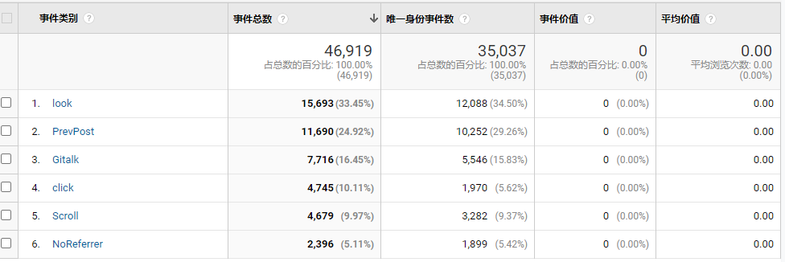
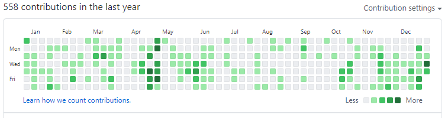

> [2019年总结传送门🚪](/2019/12/31/2019年总结/)

2020年仍然过得浑浑噩噩, 和19年没差什么,  工作是远程的, 依然在家里蹲, 只不过是从深圳蹲到了杭州, 来到了一个陌生的地方. 最近一个人过完了 21 岁的生日,  说不出来今年有啥精进的除了我那一棵歪了的技能树. 不过今年在家里蹲了一年体重没有涨

贯穿全年的词就是

乏善可陈

## 首先是本站信息汇总

2020 年站务统计

* 从去年 8 月到现在为止, 本站运行时间为 16 个月. 今年总计 `6649` 个用户(相比于去年全年有 `43.63%` 的提升), 发起了 `8752` 个会话 , 可喜可贺 **(19年数据为最后四个月 x 3)*
* 总PV为 `16920` 比去年的数据少了 `24.31%`, UV为 `13002` 比去年增加了 `9%` **(19年数据为最后四个月x3)*

* 今年点击量最高的是  [添加Unraid监控](https://haozi.moe/2019/12/23/%E6%B7%BB%E5%8A%A0Unraid%E7%9B%91%E6%8E%A7/)(956个PV)
* 总计更新了 `22` 篇文章,  ~~去年还说月均4篇~~
* 更换了新的主题配色, 去掉了 `live2d`

### 事件分析

增加了基于 [google analytics](https://analytics.google.com/) 的跟踪,  年底了看看数据结果

* `look` 和统计的 pv 差距不大
* `PrevPost`这个统计错了,  想的是统计点击上一篇文章的,  回看代码发现是 `referrer` 不为空时候的计数
* `Scroll` 则是统计滚动条是否滚动到底了,  至少说明了有 `4679` 次请求是完整的看完了页面

关于 `Gitalk` 这个评论插件, 一共被加载了 `7716` 次, 其中登录成功的有 `307 `次, 只占总统计量的 `3.98%`

`click` 的数据为下图

这个图中记录了以下类型的点击次数

* `Live2D` 戳我 `live2d`的模型的次数 (已下线)
* `FriendLink` 友链按钮
* `NextPage`  主页目录的下一页
* ` PrevPage` 主页目录的上一页

* `rss-href` RSS链接

可以发现, 非常多的人喜欢戳这个 `live2d`,  所以 2021 年会有一个新的版本站娘上线

也发现我目录页的点击量其实挺少的, Archives + NextPage 也就不到 1000 次, 说明我的文章内容还是质量不高 (每篇文章的表情包也过于巨大了, 这个也会马上解决)

## 个人相关

### 二月

* 疫情在家, 年假就5天, 抠的很, 不过是远程开发还好

### 三月

* 闲鱼收了一套 HTC vive pro 2 (三月份这种VR设备全线溢价离谱), 当时还打算玩玩开发最后坑了

### 八月

* 搬到了杭州萧山新街的一个小地方, 把除了书剩下的东西全都打包送了过来, 包括被炉桌, 和服务器

### 九月

* 肝原神

### 十月
* 肝原神

### 十一月
* 肝原神

### 十二月
* 肝原神

* 预购了一年半的 2077 终于解禁了, 爽了一周多, 就再没打开了

* 为了 2077 换了一张 3080, 有点浪费了

* 被炉真香

中间没提到的月份否很乏善可陈, 剩下的就是收集了一些奇奇怪怪的徽章, 以及一些 `yousa` 相关的周边了.

## 工作方面

这份工作虽然是远程,  虽然时间很自由, 但是经常要处理微信群的事情, 有时候是周末, 有时候的晚上10点以后, 基本是算是随叫随到. 

远程好就好在时间可以自己安排, 也不用考虑通勤的问题,  但是今年似乎没有利用好这部分的时间. 基本都是打游戏, 刷沙雕视频. 一些奇奇怪怪的重复劳动上面了

## 技术方面

今年的技能树有点歪,  本来想往大流量高并发的业务学习学习, 结果并没有这个环境. 全都在逆向APP, 写爬虫, 数据分析. 代理控制. 歪的一批, 不过也是有几点点的位置上了, 开始用`React` 和 真香的 `ant design Pro` , 写了一些  `Electron` 的项目

基于阿里云`k8s serverless` 对公司的项目做了简单的 devops , 只要阿里云的 cr 不卡, 体验还是很舒服的.(但是晚上经常卡, 一个前端构建10分钟起步 ~~可以尝试切到海外构建~~)

林林总总写了七八个小项目, 但是除了之前文章的 wms, 其他都没有写完,  大概就是懒吧. 觉得这些练手用的东西并没有什么实际作用. 就差不多试试新技术跑通就没弄了

### Github

公司项目在 github, 所以绿的比去年多,  不过有些项目就我一个人, 所以也不是天天都有提交. 上线新功能, 修bug才提交一次

~~今年唯一一个 pr 大佬还没理我~~

## 2021 年如何

* 找一份称心的工作(长期 > 3年) ~~希望是大厂~~
* 搬完家打算养一只猫(大概是一只布偶).
* 技术上面就多用用 Rust

剩下的就走一步算一步,  没啥具体打算了, 有新技术就看看新技术, 没有就刷刷题, 也不定博客任务了, 希望遇到一些有挑战性的问题(至少是值得水一篇文的那种),  游戏还是继续要打的, 沙雕视频也是要刷的

### ~

>  如果有愿意收留我(Nodejs 高级后端)的公司可以联系我哟, (联系方式在右上角 `关于`)