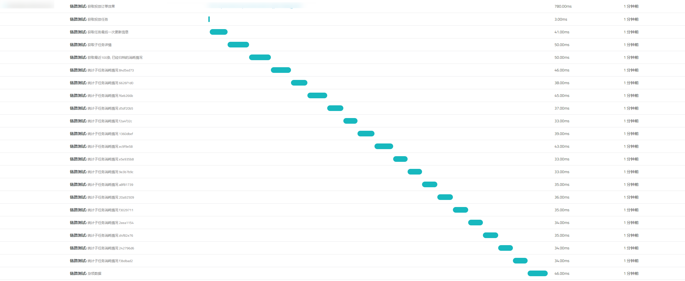

上篇找到了项目中的一个性能问题, 本篇就来实战一下 trace


<!--more-->

## 安装

按照 [Trace 链路追踪](https://help.aliyun.com/document_detail/72715.html) 文档, 安装依赖

```sh
npm install @alicloud/opentracing
```

不过这个库没有types. 可以使用我的fork [haozi23333/opentracing](https://github.com/haozi23333/opentracing), 增加了 types, ts 用起来更顺滑



安装的话使用

```sh
npm install haozi23333/opentracing
```

给原项目提了pr, 但是这玩意内部用了一个获取本地ip的库 `internal-ip` 在 `travis-ci` 上获取不到IP, 导致 ci 过不去 (上一次通过ci是在3年前), 导致现在无法合并, 就离谱


## 埋点

本项目用的是 Nest.js ,  只对一个觉得有问题的接口进行了埋点,  如果需要对大部分的接口埋点, 建议写一个中间件, 自动创建父Trace

```typescript
import { Tracer, Tags } from '@alicloud/opentracing';

@Controller('xxxx/xxxx')
export default class XXXXXController {
  public tracer = new Tracer('链路追踪')
    
  @Get('/xxx/:xxxxxx_id')
  @HttpCode(HttpStatus.OK)
  async get_xxxx_info(
    	@Req() req: Request,
    	@Param('xxxxxx_id') xxxxxx_id: string,
    ) {
    // 创建父 Span
    const parentSpan = this.tracer.startSpan('获取投放订单效果')
    // 添加基础信息
    span.setTag(Tags.PEER_HOSTNAME, req.hostname)
    span.setTag(Tags.HTTP_METHOD, req.method.toUpperCase())
    span.setTag(Tags.HTTP_URL, req.url)
        
    // 创建新的 span, 父级就上面的
    const task1 = this.tracer.startSpan('获取投放任务', { childOf: parentSpan})
    // 增加一个 tag信息
    task1.setTag('xxxxxx_id', xxxxxx_id)
    const promote = await this.promoteTaskModel.findOne({xxxxxx_id})
    
    // 结束就调用 finish, 需要传入 req
    task1.finish(req)
            
    // 也可以用 log来添加日志
    const task2 = this.tracer.startSpan('杂项数据')
    const statistics = await this.promoteService.getXXXStatistics(xxxxxx_id)
	task2.logEvent('statistics', 'ok');
    const running_order = (await this.redisService.getClient().keys(RedisKey.promote_task(xxxxxx_id, '*', '*'))).length
    task2.logEvent('running_order', running_order);
    // 中间省略N个
    task2.finish(req)

            
    // 巴拉巴拉. task2 task3 .... task6  
    
    // 结束的时候, 调用父级的
    // 如果是中间件开始的, 就在中间件里面去finish `HTTP_STATUS_CODE` 这个一定要有
    span.setTag(Tags.HTTP_STATUS_CODE, HttpStatus.OK)
    span.finish(req)
  }
}

```

> 要注意一定要添加`HTTP_METHOD`, `HTTP_URL`, `HTTP_STATUS_CODE` 这个三个tag, 不然平台会丢弃这个数据

之后就是启动项目了

## 效果


有点离谱,  在晚上高峰期, 平台运行任务的时候, 最长的一个请求竟然高达1.68s

重新拆分了统计子任务消耗情况,  生成的图表



分析了一下代码, 这个特殊请求里面有 (数据库为 MongoDB)

* `findOne` 4+次
* `aggregate` 20+次
* redis `keys` 15+次(总数不多)

这个请求干的事情确实有点多, 而且都是串行的, 没做缓存也没做并行, 数据即使没做变动, 也会去 `aggregate`动态计算

不过没啥难度, 优化完成之后, 已经不会在上面显示了

有点奇怪的是,  `logEvent` 这个函数, 其实会记录一个 `startTimeFromFullTrace`的时间,   但是这个Logs上面 没有任何表示(F12看数据里面也有有的)挺遗憾的, 要是也有个时间轴就好了


## 任意函数埋点

```typescript
// 在这一步, 下面的都自己可以写
const parentSpan = this.tracer.startSpan('获取投放订单效果')
span.setTag(Tags.PEER_HOSTNAME, req.hostname)
span.setTag(Tags.HTTP_METHOD, req.method.toUpperCase())
span.setTag(Tags.HTTP_URL, req.url)
span.setTag(Tags.HTTP_STATUS_CODE, HttpStatus.OK)

// 但是这一步不一样, 这个 finish 会去检查 req 是否继承自 IncomingMessage ('http' 库内)
span.finish(req)
// 但是, 可以自己new一个 IncomingMessage,  new IncomingMessage(null) 即可
```


## 后~

还没遇到过真实的大项目出现性能问题...,  能想到的就是做个灰度发布, 放部分流量进来跟踪一下, 